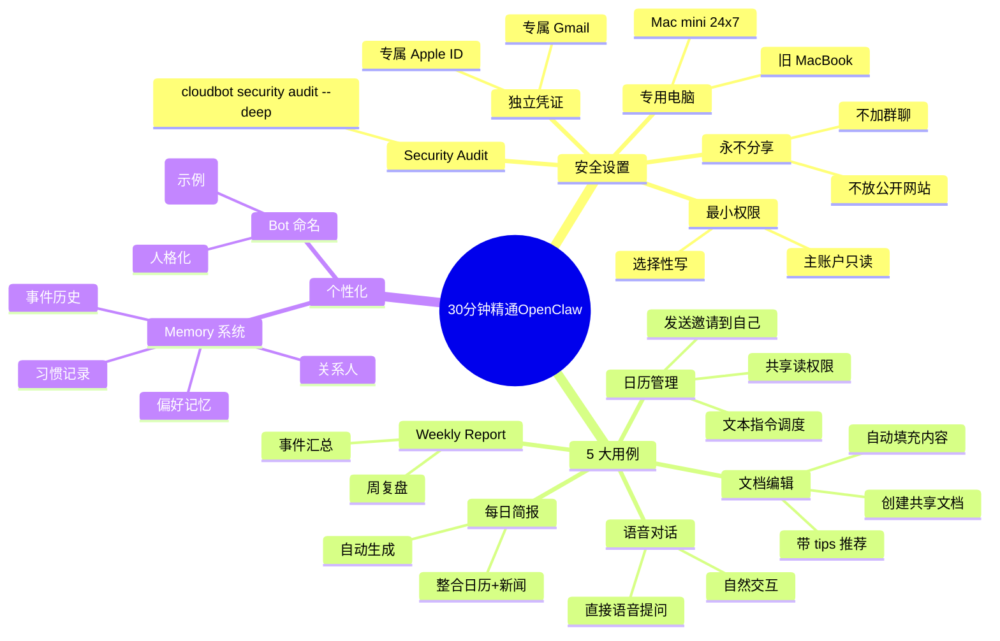

# 30 分钟精通 OpenClaw（5 个真实用例 + 设置 + 内存）

## 一句话总结

一位 OpenClaw 早期用户（用了一个星期）分享**安全设置 + 5 个真实用例** — 从 Mac mini 跑、专用凭证、Security Audit、日历管理、文档编辑、语音对话、每日简报到 Weekly Inside Report，并深入讲解如何让 Bot **真正个性化**（包括 memory 机制）。核心结论：OpenClaw 是他用过最好的个人 AI 助理，但仍是非常早期的软件。

## 核心洞察

### 1. 安全设置 5 步走

> "Number one, run it on a dedicated computer."

1. **专用电脑**：作者用 Mac mini 24x7 运行（任何旧 MacBook 都行）
2. **独立凭证**：OpenClaw 用自己的 Apple ID + Gmail，不能访问主账户
3. **Security Audit**：在 Terminal 跑 `cloudbot security audit --deep`
4. **最小权限**：主账户只共享读权限 + 选择性文件写权限
5. **永不共享 Bot**：**不要加群聊、不要放公开网站**（参考已经泄露的案例）

> "My bot can only talk to me and me alone."

### 2. 5 个真实用例

#### 用例 1：日历管理

- 把个人日历**共享**给 Zoe（OpenClaw Bot）
- 文本指令："找周日上午 10 点左右的火车班次"
- Zoe 自动 search + 推送 + 发送邀请到你的主账户
- 用 Bot 的 calendar 邀请自己，主账户接受/拒绝

> "Just imagine I'm on the go and I want to quickly schedule something. It's just way easier to text Zoe than to actually go into Google calendar."

#### 用例 2：编辑文档

- 创建共享文档 `Peter-Zoe`
- 文本指令："把今天的家庭出游计划写进那个文档"
- Zoe 自动填充：交通、目的地、餐饮推荐（带 tips）

#### 用例 3：语音对话

- Bot 支持 voice message
- 可以直接用语音提问

#### 用例 4：每日简报

- Bot 自动生成每日简报
- 整合日历 + 新闻 + 任务

#### 用例 5：Weekly Inside Report

- 每周报告
- 整合一周的事件、任务完成情况、关键数据

### 3. Memory 机制（让 Bot 真正个性化）

OpenClaw 有 **memory 系统**，让 Bot 记住：
- 你的偏好
- 你的习惯
- 你的关系人
- 过去的事件

这让它从"工具"变成"助理"。

### 4. 关于"独立 Bot"的安全哲学

> "This last one is super important. Here's a tweet from an OpenCloud contributor on how most book someone's vibe coded app started leaking confidential stuff to the public."

**最常见错误**：把自己的 Bot 给别人用 → 数据泄露
**正确做法**：每个用户只用自己的 Bot，永远不要分享

## 关键概念

| 概念 | 定义 |
|------|------|
| **Zoe** | 作者的 OpenClaw Bot 名字（个性化命名） |
| **Mac mini** | 推荐的 OpenClaw 运行环境，24x7 不间断 |
| **Security Audit** | `cloudbot security audit --deep` 内置安全检查命令 |
| **独立凭证** | OpenClaw 用自己的 Apple ID + Gmail，与主账户隔离 |
| **共享 vs 授权** | 主账户日历只**共享读**给 OpenClaw，OpenClaw 写自己的 calendar |
| **Memory 系统** | OpenClaw 的个性化记忆层，让 Bot 理解用户偏好 |
| **5 大用例** | 日历、文档、语音、每日简报、每周报告 |
| **永不分享** | 关键安全原则：Bot 只跟自己对话 |

## 实战最佳实践

### 设置清单

```
□ 准备专用电脑（Mac mini 24x7）
□ 创建独立 Apple ID + Gmail
□ 安装 OpenClaw
□ 运行 cloudbot security audit --deep
□ 共享必要数据（最小权限）
□ 自定义 Bot 名字（人格化）
□ 启用 voice / calendar / docs 集成
□ 配置 memory 系统
```

### 推荐安全等级

| 等级 | 适用场景 | 权限 |
|------|---------|------|
| **L1 探索** | 新手 | 只读 + 选择性写 |
| **L2 日常** | 进阶用户 | 读 + 写共享文档 + 日历邀请 |
| **L3 全权** | 完全信任 | 读 + 写主账户（**不推荐**） |

### 5 大用例优先级

1. **日历管理** — 上手最快，立即有用
2. **文档编辑** — 节省手动操作
3. **语音对话** — 自然交互
4. **每日简报** — 减少信息过载
5. **每周报告** — 复盘工作

## 思维导图



## 原文金句（英中对照）

> **"Hey everyone, so a week in and I think OpenCloud is generally the best personal AI assistant that I've ever used. It truly feels like talking to a trusted friend who can actually get stuff done for me."**
> 译：*大家好，用了一个星期，我觉得 OpenClaw 是我用过的最好的个人 AI 助理。它真的像在和一个能帮你搞定事情的可信朋友聊天。*

> **"Number one, run it on a dedicated computer. I installed it on a Mac mini, but any old MacBook would do. You have to keep it running 24 or 7, though, so that it stays on."**
> 译：*第一，跑在专用电脑上。我装在 Mac mini 上，但任何旧 MacBook 都行。不过你得 24x7 保持开机，让它一直在。*

> **"My OpenCloud uses its own Apple and Gmail ID. It does not have access to my main Gmail account other than the files that I've shared with it."**
> 译：*我的 OpenClaw 用自己的 Apple ID 和 Gmail。除了我共享的文件，它访问不到我的主 Gmail。*

> **"Never share your bot with anyone else. Don't add it to group chats or any websites. You know, this last one is super important."**
> 译：*永远不要把 Bot 分享给别人。不要加群聊，不要放任何公开网站。这最后一点超级重要。*

> **"Just imagine I'm on the go and I want to quickly schedule something. It's just way easier to text Zoe than to actually go into Google calendar and create an event and do all that crap."**
> 译：*想象一下我在路上要快速安排事情，发文字给 Zoe 比真去 Google Calendar 创建活动再搞那些破事简单太多。*

> **"This is still really early software. So I want to do a deep dive on how to set it up safely."**
> 译：*这还是相当早期的软件。所以我想深入讲讲如何安全地设置它。*

## 行动启示

1. **安全第一** — 独立凭证、专用电脑、最小权限、永不分享
2. **5 个用例按需启用** — 从日历开始，逐步加文档、语音、简报
3. **Memory 是关键** — 让 Bot 真正个性化需要 memory 系统支持
4. **Mac mini 是推荐环境** — 24x7 不间断、便宜、低功耗
5. **Bot 命名很重要** — 人格化命名增强关系感（"Zoe" 案例）
6. **不要泄露 Bot 凭证** — 一旦泄露，所有连接的服务都暴露

## 关联笔记

- [[MOC - Agent Theory and Design]] — AI Agent 总索引
- [[MOC - Agent Theory and Design]] — B站视频知识库索引
- [[OpenClaw 创始人-我是如何使用OpenClaw的？]] — 创始人视角
- [[Claude Code负责人-AI原生团队如何使用AI]] — Claude Code 内部视角
- [[AI Agent Development]] — AI Agent 开发系统知识
- [[OpenClaw]] — OpenClaw 项目（待创建）

## 来源

- **原始视频**：[BV1kWctzeEYK - 30分钟精通OpenClaw（5个真实用例+设置+内存）](https://www.bilibili.com/video/BV1kWctzeEYK/)
- **UP主**：[Easonlee的AI笔记](https://space.bilibili.com/3546559488723681/upload/video)
- **生成工具**：Recastory（手动 ingest + faster-whisper 转录 + LLM distill）
- **生成日期**：2026-06-10
- **转录模型**：faster-whisper base（en）
- **规范**：英文原文附中文翻译（[[kb-english-chinese-translation|记忆规则]]）
