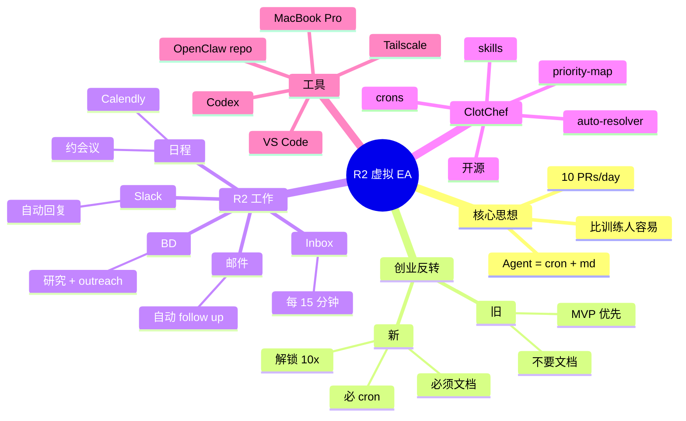

# 5 次创业者：AI 智能体独自经营初创公司

## 一句话总结

5 次创业者 **Ryan Carson** 分享他如何用 **OpenClaw 打造极致个人助理 R2**（包括 ClotChef 系统）— 通过 cron jobs + .md 文件让 R2 处理日程、邮件 outreach、business development 等任务，**从"创业公司要快"转向"创业公司要文档化"** 的全新 Agent-Native 创业哲学。

## 核心洞察

### 1. Agent = Cron Jobs + Markdown

> "The big thing everybody needs to remember about agents is that they are cron jobs and markdown files."

**核心思想**：
- Agent **本质上** = cron jobs（定时任务）+ .md 文件（指令）
- 听起来简单，但威力巨大

> "I'm probably shipping at these 10 PRs a day, sometimes a lot more. It's almost easier to onboard and train agents than to train humans."

**生产力数据**：
- 每天 10+ PRs
- **训练 Agent 比训练人容易**

### 2. 创业哲学 180 度反转

> "Just do the bare minimum to get the MVP out. Do not spend time on systems or processes or documentation. That's literally reverse now."

**旧哲学**（创业公司经典）：
- 做最少到 MVP
- 不花时间在系统/流程/文档
- "Move fast and break things"

**新哲学**（Agent 时代）：
- **必须**花时间建文档、参考图
- 把所有都打包到 cron job + skill file
- **突然就解锁了 10 人份的工作量**

> "So now, as startup founder, you have to spend a lot of time to set up your documentation, your reference images, build all that into a cron job, the skill file, and then you suddenly are unlocked and you're doing the work of 10 people."

### 3. R2 = 我的虚拟 Executive Assistant

> "I've been fortunate to run a number of companies. I've had several real executive assistants that are humans in the past. And my goal was to turn R2, my OpenClaw into an amazing executive assistant or chief of staff."

**R2 角色**：
- 替代**真实的人** Executive Assistant
- 当 **Chief of Staff**

**R2 做的事**：
1. **日程管理**：解析 Calendly 链接、自动约会议
2. **Inbox 扫描**：每 15 分钟扫一遍 inbox + calendar + priorities
3. **Slack 消息**：在主沟通频道 ping 自己
4. **邮件跟进**：发现没回，自动 follow up
5. **BD 拓展**：每天研究 → 找潜在客户 → 自动 outreach

### 4. ClotChef 系统：开源

> "I built a system called Clotchef. What Clotchef is basically a set of markdown files. And that's basically it. It's really simple. It's some cron jobs and some markdown files."

**ClotChef 构成**：
- 一组 .md 文件（指令）
- 一组 cron jobs（自动化）
- **开源** — 任何人都能用

**核心 3 组件**：
- **Priority Map**（优先级地图）— 告诉 R2 "我关心什么"
- **Auto-resolver**（自动解决器）— "R2 能自己解决就别问我"
- **Skills**（技能）— 具体任务能力

### 5. SSH + Codex 配置 OpenClaw

> "I SSH into the MacBook Pro, which is down here in my closet. And that's where R2 lives. So SSHing through tailscale is like a perfect way to configure your Open Clot."

**实战设置**：
- **MacBook Pro** 放在壁橱里（24/7 跑 R2）
- **Tailscale** 远程访问
- **VS Code** SSH 进去
- **Codex** 帮忙配置（Codex plugin 已装）
- 流程：跟 Codex 说话 → Codex 改 R2 配置

> "You want to allow Codex or your OpenClaw to inspect its own code, right? So often what I'll say to Codex is go pull the latest changes on the OpenClaw repo and look at the source code and tell me, you know, how to update yourself to do XYZ."

**Pro Tip**：用 Codex 拉 OpenClaw 仓库源码，让 Codex 帮 R2 自己升级。

### 6. 监控设置：SystemD 备份

> "I back her up every night with like a systemD service."

**自动化**：
- SystemD service 每晚自动备份
- 保证数据不丢

## 关键概念

| 概念 | 定义 |
|------|------|
| **R2** | Ryan 的 OpenClaw Bot（Executive Assistant） |
| **ClotChef** | Ryan 开源的 OpenClaw 配置系统 |
| **Priority Map** | 告诉 Agent "我关心什么" |
| **Auto-resolver** | Agent 能自己解决就别问 |
| **Cron Jobs** | Agent 的"心脏"（定时执行） |
| **Markdown Files** | Agent 的"灵魂"（指令） |
| **Tailscale** | VPN 远程访问 |
| **Codex OpenClaw Workflow** | 用 Codex 配置 OpenClaw |
| **MVP Anti-Pattern (Reversed)** | 创业公司文档化成为必须 |
| **OpenClaw Repo Clone** | 让 Codex 能读源码辅助配置 |

## 实战工作流

### R2 每日自动化

```
09:00  早间简报
  - 扫 inbox
  - 看 calendar
  - 列出 priorities
  - Slack ping

10:00  BD outreach
  - 研究潜在客户
  - 加入 spreadsheet
  - 以 Ryan 名义发邮件

15:00  每 15 分钟
  - Inbox 扫描
  - 邮件跟进
  - 自动 follow up

持续  Slack 监听
  - 自动回复
  - 约会议

每天  备份
  - SystemD 自动
  - 每天一份
```

### ClotChef 文件结构

```
clotchef/
├── priority-map.md       # 优先级地图
├── auto-resolver.md      # 自动解决器
├── skills/               # 技能库
│   ├── calendar.md
│   ├── email.md
│   ├── bd-outreach.md
│   └── ...
├── crons/                # cron jobs
│   ├── morning-brief.sh
│   ├── inbox-scan.sh
│   └── ...
└── README.md
```

## 思维导图



## 原文金句（英中对照）

> **"The big thing everybody needs to remember about agents is that they are cron jobs and mark down files."**
> 译：*大家要记住的最关键一点是：Agent 本质上就是 cron jobs 加 Markdown 文件。*

> **"I'm probably shipping at these 10 PRs a day, sometimes a lot more. It's almost easier to onboard and train agents than to train humans."**
> 译：*我现在大概每天 ship 10 个 PR，有时候更多。训练 Agent 比训练人类容易多了。*

> **"Just do the bare minimum to get the MVP out. Do not spend time on systems or processes or documentation. That's literally reverse now. So now, as startup founder, you have to spend a lot of time to set up your documentation, your reference images, build all that into a cron job, the skill file, and then you suddenly are unlocked and you're doing the work of 10 people."**
> 译：*"做最少到 MVP 就行，别花时间在系统/流程/文档上"——这话现在反过来了。作为创业公司创始人，你必须花很多时间建文档、参考图，把这些都打包到 cron job 和 skill 文件里，然后突然就解锁了，做着 10 个人的活。*

> **"I've been fortunate to run a number of companies. I've had several real executive assistants that are humans in the past. And my goal was to turn R2, my OpenClaw into an amazing executive assistant or chief of staff."**
> 译：*我比较幸运，运营过几家公司，过去有好几个真正的人类 Executive Assistant。我的目标是把我的 R2（我的 OpenClaw）变成一个出色的 Executive Assistant 或幕僚长。*

> **"What Clotchef is basically a set of markdown files. And that's basically it. It's really simple. It's some cron jobs and some markdown files."**
> 译：*ClotChef 本质上就是一组 Markdown 文件。就这样。很简单，就是一些 cron jobs 加一些 Markdown 文件。*

> **"You want to allow Codex or your OpenClaw to inspect its own code, right? So often what I'll say to Codex is go pull the latest changes on the OpenClaw repo and look at the source code and tell me, you know, how to update yourself to do XYZ."**
> 译：*你要让 Codex 或你的 OpenClaw 检查自己的代码。所以我经常让 Codex 拉 OpenClaw 仓库最新改动，看源码，告诉我"怎么升级自己去做 XYZ"。*

## 行动启示

1. **Agent = cron + md** — 极简核心
2. **训练 Agent 比训练人容易** — 创业公司新哲学
3. **必须文档化** — Agent 时代要"花时间在系统"
4. **ClotChef 模式可复用** — 一组 md + crons
5. **Priority Map** — 告诉 Agent 关心什么
6. **Auto-resolver** — 能解决就别问
7. **用 Codex 配置 OpenClaw** — 自我升级

## 关联笔记

- [[MOC - Agent Theory and Design]] — AI Agent 总索引
- [[MOC - Agent Theory and Design]] — B站视频知识库索引
- [[OpenClaw创始人-我是如何使用OpenClaw的？]] — OpenClaw 创始人
- [[30分钟精通OpenClaw]] — OpenClaw 入门
- [[OpenClaw实战：从本地到K8S部署]] — OpenClaw K8S
- [[Taven创始人-将OpenClaw嵌入产品的实战经验]] — OpenClaw 企业
- [[Claude Code实战-结合Obsidian打造第二大脑]] — Claude Code Obsidian
- [[AI Agent Development]] — AI Agent 开发系统知识
- [[ClotChef]] — Ryan Carson 的开源系统（待创建）

## 来源

- **原始视频**：[BV174GU6AEZY - 这位5次创业者如何利用AI智能体独自经营初创公司](https://www.bilibili.com/video/BV174GU6AEZY/)
- **UP主**：[Easonlee的AI笔记](https://space.bilibili.com/3546559488723681/upload/video)
- **生成工具**：Recastory（手动 ingest + faster-whisper 转录 + LLM distill）
- **生成日期**：2026-06-10
- **转录模型**：faster-whisper base（en）
- **规范**：英文原文附中文翻译（[[kb-english-chinese-translation|记忆规则]]）
