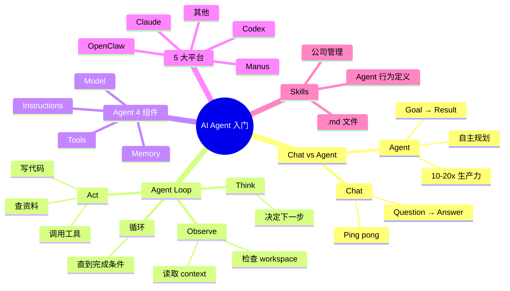

# Agent 实战：打造一个 AI Agent 的完整教程

## 一句话总结

Greg Eisenberg 主持，AI Agent 教育者 **Remi Gasiglia** 系统讲解 **AI Agent 完整入门** — 用最简单的话解释 chat 模型 vs Agent 的本质区别、Agent Loop 三步循环、Agent 4 大组成组件，以及如何用 .md 文件（Skills）管理 Agent 行为，让初学者能快速搭建"高管助理、市场主管、CFO"等 Agent 团队。

## 核心洞察

### 1. Chat vs Agent：本质区别

> "A chat model is question to answer. But then an agent is goal to result."

| 类型 | 范式 | 你做什么 | AI 做什么 |
|------|------|----------|----------|
| **Chat Model** | Question → Answer | 提问 | 回答 |
| **Agent** | Goal → Result | 给目标 | 自己 plan + execute + 交付 |

> "Chat is ping pong back and forth. Agent is you give it a goal, and it works towards it."

**2 大范式转移**：
- 从"你问 AI 答，你做事"
- 到"你给 Agent 任务，Agent 自己规划执行交付"

### 2. 为什么现在必须学 Agent

> "The founders and employees that are utilizing agents are no word of a lie 10 to 20 times more productive in their day. And when you stack that up over days, weeks, years, you're going to just be miles ahead of the competition."

> "I feel like the AI landscape is moving into stage two from chat to agents. And most people are getting left behind right now just using the chat models."

**生产力差异**：用 Agent 的人**10-20 倍** 比只用 chat 的人更高效。

### 3. Agent Loop 三步循环

> "Inside this agent step, we have what's called the agent loop. So you give it your prompt or task and it goes through these three steps here, which is observe, think and act."

**三步循环**：
1. **Observe**（观察）— 检查 workspace、读取 context
2. **Think**（思考）— 决定下一步
3. **Act**（行动）— 执行（写代码、查资料等）
- 循环直到任务完成

**示例**：建 Greg 的 portfolio website
- 收到 prompt → 检查文件 → 发现没 Greg 信息
- → **Observe**: research Greg
- → **Think**: 写计划
- → **Act**: 写代码
- 循环直到 complete

### 4. Agent 4 大组成组件

**构成**：
- **Model** — LLM
- **Tools** — 可调用的工具
- **Instructions** — 系统 prompt
- **Memory** — 跨 session 记忆

### 5. 任务完成判定

> "How it concludes that the task is complete is based on the parameters that you set in your prompt."

**完成条件**：
- 例：研究任务"compile 10 sources + 创建 PowerPoint"
- 完成 10 sources + 报告后自动 conclude
- 输出交付给用户

### 6. .md 文件即 Skills：公司管理之道

> "You've structured your company where you basically have these folders and .md files that run your company."

**核心思想**：用 .md 文件（Skills）定义 Agent 行为：
- 类似公司制度文档
- 每个 Agent 一个 .md
- 训练 Agent 遵守这些"公司规则"

### 7. 5 大可用 Agent 平台

> "You can build up agents to run complete departments of your life and your company within any agent platform you choose whether it's Claude Codex, OpenClaw, Manus, all of them."

| 平台 | 特点 |
|------|------|
| **Claude** (Claude Code) | Anthropic 官方 |
| **Codex** (Codex CLI) | OpenAI 官方 |
| **OpenClaw** | 创始人实操 |
| **Manus** | 中国 AI Agent 框架 |
| 其他 | ... |

## 关键概念

| 概念 | 定义 |
|------|------|
| **Chat Model** | Question → Answer 范式 |
| **Agent** | Goal → Result 范式，自主 plan + execute |
| **Agent Loop** | Observe → Think → Act 三步循环 |
| **Observe** | 观察：检查 workspace、读取 context |
| **Think** | 思考：决定下一步行动 |
| **Act** | 行动：执行（写代码、查资料） |
| **Tools** | Agent 可调用的工具集 |
| **Instructions** | Agent 的系统 prompt（行为准则） |
| **Memory** | 跨 session 的持久化记忆 |
| **Skill (.md)** | 用 Markdown 文件定义 Agent 角色/行为 |
| **Harness** | 围绕 Agent 的工程系统 |

## Agent Loop 工作流

```
用户 prompt / task
    ↓
┌─────────────┐
│  OBSERVE   │ ← 检查 workspace、读取文件
└──────┬──────┘
       ↓
┌─────────────┐
│   THINK    │ ← 决定下一步
└──────┬──────┘
       ↓
┌─────────────┐
│    ACT     │ ← 执行（写代码/查资料/调用工具）
└──────┬──────┘
       ↓
   完成条件？ ─否─→ 回到 OBSERVE
       ↓ 是
   输出结果
```

## 思维导图



## 原文金句（英中对照）

> **"I think AI is confusing. There, I said it. I think there's a lot of terms, skills, MCPs, Agent harnesses that are difficult concepts to understand."**
> 译：*我觉得 AI 让人困惑。我就说出来了。术语太多 — Skills、MCP、Agent Harness — 都是难懂的概念。*

> **"The founders and employees that are utilizing agents are no word of a lie 10 to 20 times more productive in their day. And when you stack that up over days, weeks, years, you're going to just be miles ahead of the competition."**
> 译：*用 Agent 的创始人和员工，毫不夸张地说日生产力是其他人的 10-20 倍。日积月累，你会把竞争者远远甩在后面。*

> **"I feel like the AI landscape is moving into stage two from chat to agents. And most people are getting left behind right now just using the chat models."**
> 译：*我觉得 AI 正从"聊天"迈向"Agent"的第二阶段。现在大多数人只用 chat 模型，已经落后了。*

> **"A chat model is question to answer. But then an agent is goal to result. So moving from just like you asking AI replies then you do the work to you giving the agent a task. It planning out the task and then executing and then delivering you a result."**
> 译：*Chat 模型是"提问-回答"。Agent 则是"目标-结果"。从你问 AI 答、你做事，过渡到：你给 Agent 任务，它自己规划、执行，然后把结果交付给你。*

> **"Inside this agent step, we have what's called the agent loop. So you give it your prompt or task and it goes through these three steps here, which is observe, think and act."**
> 译：*在这个 Agent 步骤内部，就是所谓的 Agent Loop。你给它 prompt 或任务，它会走三步：observe、think、act。*

> **"You can build up agents to run complete departments of your life and your company within any agent platform you choose whether it's Claude, Codex, OpenClaw, Manus, all of them."**
> 译：*你可以在任何 Agent 平台——Claude、Codex、OpenClaw、Manus 都可以——搭建 Agent 来管理你生活和公司的完整部门。*

> **"You've structured your company where you basically have these folders and .md files that run your company."**
> 译：*你搭的公司本质上就是用这些文件夹和 .md 文件在运转。*

## 行动启示

1. **从 Chat 思维转向 Agent 思维** — 给目标而不是问问题
2. **理解 Agent Loop** — Observe → Think → Act 循环
3. **学 5 大平台之一** — Claude/Codex/OpenClaw/Manus 任选
4. **用 .md 文件管理 Agent** — 就像公司制度
5. **设置清晰完成条件** — 让 Agent 知道何时结束
6. **从简单任务开始** — 比如"build a portfolio site"
7. **每部门一个 Agent** — 高管助理、市场、CFO

## 关联笔记

- [[MOC - Agent Theory and Design]] — AI Agent 总索引
- [[MOC - Agent Theory and Design]] — B站视频知识库索引
- [[Cursor副总裁-构建软件开发过程的Agent]] — Cursor 团队视角
- [[OpenAI官方-Codex新手教程]] — Codex 平台
- [[OpenClaw创始人-我是如何使用OpenClaw的？]] — OpenClaw 平台
- [[Manus创始人-深度干货-上下文工程的最佳实践]] — Manus 平台
- [[AI Agent Development]] — AI Agent 开发系统知识
- [[Chat vs Agent]] — 对比笔记（待创建）
- [[Agent Loop]] — 三步循环详解（待创建）

## 来源

- **原始视频**：[BV1PnQfBvEs3 - Agent实战：打造一个AI Agent的完整教程](https://www.bilibili.com/video/BV1PnQfBvEs3/)
- **UP主**：[Easonlee的AI笔记](https://space.bilibili.com/3546559488723681/upload/video)
- **原始播客**：Greg Eisenberg 主持的 AI Agent 入门播客
- **生成工具**：Recastory（手动 ingest + faster-whisper 转录 + LLM distill）
- **生成日期**：2026-06-10
- **转录模型**：faster-whisper base（en）
- **规范**：英文原文附中文翻译（[[kb-english-chinese-translation|记忆规则]]）
