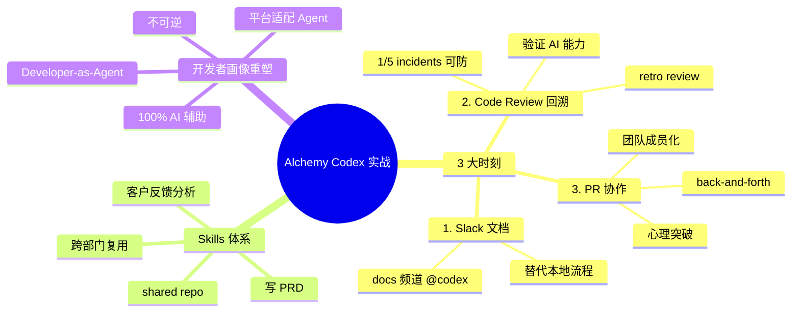

# Alchemy CPO：从代码审查到自动代理

## 一句话总结

Alchemy CPO **Matthias**（前 Facebook 开发者平台背景）分享他们用 AI（Codex）**改造公司工作流**的 3 个关键时刻 — 从 Slack 文档编辑 → Code Review 回溯性"AI 是否能抓到" → PR 协作反馈循环，并讨论了 AI 时代"开发者画像"如何被重塑。

## 核心洞察

### 1. 第一个时刻：Slack 文档编辑

> "The first thing we used it for was to make small edits to our documentation or developer docs from Slack."

- 1 年前开始用 Codex
- 第一场景：**Slack 里直接编辑文档**
- 之前：本地跑 site → 复杂流程
- 现在：Slack docs 频道 → `@codex make changes`

### 2. 第二个时刻：Code Review 回溯

> "We had a small incident that was related to a big migration that had happened months prior. We fixed it and someone on the team had the idea to retroactively run code review from codecs to see if codecs would have caught the bug."

**突破性实验**：
- 出 bug → 修复 → 内部 postmortem
- **新点子**：让 Codex **回溯** review 那个 PR，看它是否能抓到 bug
- **结果**：能抓到！

> "That was a bit of a turning point in terms of model capability and a lot of the ingredients were right for teams to start adopting those tools more."

**关键数据**：
- Datadog 1 月报告：1/5 incidents 可被 Codex 抓到
- GPT-5.5 后比例更高

### 3. 第三个时刻：工程师与 Codex 协作

> "He submitted a PR that I saw go through Slack. I clicked through it and I saw how to do at codecs review, address the comments that codecs would come up with. Then review again, do that again and he was just doing this back and forth with codecs."

**观察到的转变**：
- 工程师把 Codex 当作**团队成员**
- PR 走完 Slack → 点开 → 看 Codex review
- 改 → 再 review → 再改
- **back-and-forth 协作**

> "People were getting over the hurdle of thinking that LLMs were good enough to help in a professional setting with a really large complex code base with code that needs to be good enough to be served to a lot of people."

**心理突破**：从"AI 不够专业" → "AI 能帮大型 code base"。

### 4. Skills 共享：公司级复用

> "We've created all these skills internally to help us do the PM job more easily and better and faster. That includes writing PRDs, analyzing customer feedback, doing all those things. I use codecs for that and several members of the team reuse those skills as well. We have this shared repo of skills across the company."

**Skills 体系**：
- 公司级 **shared repo of skills**
- 跨部门复用（不只 PM 用）
- 涵盖：写 PRDs、分析客户反馈、典型 PM 任务
- **不只快** — 还能让非 PM 的人做 PM 工作

### 5. AI 时代的"开发者画像"重塑

> "We have to think about these agents and making sure that tools like codecs can actually integrate openAI, ZPI, Alchemy's infrastructure are very quickly."

> "Now we are very much assuming that 100% of developers are building software with the help of AI."

**核心转变**：
- 不再把开发者当"纯人类"
- 也要为 **Agent as user** 设计
- 假设 **100% 开发者** 都用 AI 辅助
- **开发者平台**必须支持 Agent

## 关键概念

| 概念 | 定义 |
|------|------|
| **Alchemy** | 加密/Web3 基础设施公司，CPO 来自 Facebook 开发者平台 |
| **Code Review 回溯** | 用 AI 重新 review 过去的 PR，看是否抓到 bug |
| **Slack docs 编辑** | 通过 Slack 直接让 Codex 改文档（替代本地 site 流程） |
| **Shared Skills Repo** | 公司级 skills 仓库，跨部门复用 |
| **PRDs** | 产品需求文档（用 Skill 写） |
| **Customer Feedback Analysis** | 客户反馈分析（用 Skill 自动） |
| **Developer-as-Agent** | 把开发者当 Agent 服务的思维 |
| **Codex as Team Member** | 工程师把 Codex 当团队成员协作 |

## 实战工作流

### Codex 3 大使用场景

```
场景 1：Slack 文档协作
  @codex make changes
    ↓
  Slack 频道直接编辑 docs
    ↓
  替代本地 site + git commit

场景 2：Code Review 回溯
  修复 bug
    ↓
  回顾历史 PR
    ↓
  retro: codex review that PR
    ↓
  验证 AI 能否抓到
    ↓
  建立信任

场景 3：Skills 库复用
  PM 写 PRD Skill
    ↓
  公司 shared repo
    ↓
  任何人都能用
    ↓
  提升非 PM 人员的 PM 能力
```

## 思维导图



## 原文金句（英中对照）

> **"The first thing we used it for was to make small edits to our documentation or developer docs from Slack. So we went from having to run the site locally and doing that whole process that is fairly involved to just being able to add codecs on Slack in the docs channel in our company Slack and to be able to just tell it to make changes."**
> 译：*我们用它做的第一件事是在 Slack 里直接改我们的文档和开发文档。从之前要在本地跑站点、经过那套复杂的流程，到现在只需要在公司 Slack 的 docs 频道加一个 Codex，告诉它"做改动"就行。*

> **"We had an internal postmortem about the incident and we basically identified what the race condition was. We fixed it and someone on the team had the idea to retroactively run code review from codecs to see if codecs would have caught the bug."**
> 译：*我们做了一次内部 postmortem，找到了 race condition。修完之后，团队里有人想到一个点子——回溯地用 Codex 跑 code review，看它能不能抓到那个 bug。*

> **"I remember talking to many companies were just getting into AI coding. Code review was the first moment when they realized that many incidents they had could be caught actually by codecs automatically. They replayed some of those similar to alchemy. I remember a data doc, for instance, back in January said that one incident out of five could have been saved by codecs."**
> 译：*我聊过很多刚开始用 AI 编程的公司。Code review 是他们第一个意识到"原来我们很多事故其实可以由 Codex 自动抓到"的时刻。Datadog 1 月的报告就说 1/5 的事故本可由 Codex 避免。*

> **"We have this shared repo of skills across the company, across all the different functions. So that not only we can do the same job and the same tasks faster and better, but also more people who are not necessarily PMs are able to do that."**
> 译：*我们有一个全公司跨职能共享的 skills 仓库。这不仅让我们把同样的工作做得更快更好，也让那些不是 PM 的人也能做 PM 的事。*

> **"Now we are very much assuming that 100% of developers are building software with the help of AI. Right."**
> 译：*现在我们坚定地假设 100% 的开发者都在用 AI 辅助构建软件。*

## 行动启示

1. **从 Slack 文档开始** — 最低门槛的 AI 应用场景
2. **Code Review 回溯** — 用历史 PR 验证 AI 能力，建立信任
3. **PR back-and-forth** — 把 AI 当团队成员
4. **Shared Skills Repo** — 公司级 skills 库，跨部门复用
5. **不只快** — Skills 还能让非专家做专家工作
6. **100% AI 辅助假设** — 产品设计要为 Agent 服务
7. **Code Review 是转折点** — 大多数公司的 AI 启蒙都从这开始

## 关联笔记

- [[MOC - Agent Theory and Design]] — AI Agent 总索引
- [[MOC - Agent Theory and Design]] — B站视频知识库索引
- [[OpenAI官方-Codex新手教程]] — Codex 官方视角
- [[Codex实战-构建全能AI营销团队]] — Codex 实战
- [[IBM团队-Harness工程详解]] — Harness 工程
- [[Taven创始人-将OpenClaw嵌入产品的实战经验]] — Skills 架构
- [[AI Agent Development]] — AI Agent 开发系统知识
- [[Code Review Patterns]] — AI 辅助 Code Review（待创建）

## 来源

- **原始视频**：[BV1i9E366EAr - Alchemy CPO：从代码审查到自动代理](https://www.bilibili.com/video/BV1i9E366EAr/)
- **UP主**：[Easonlee的AI笔记](https://space.bilibili.com/3546559488723681/upload/video)
- **生成工具**：Recastory（手动 ingest + faster-whisper 转录 + LLM distill）
- **生成日期**：2026-06-10
- **转录模型**：faster-whisper base（en）
- **规范**：英文原文附中文翻译（[[kb-english-chinese-translation|记忆规则]]）
