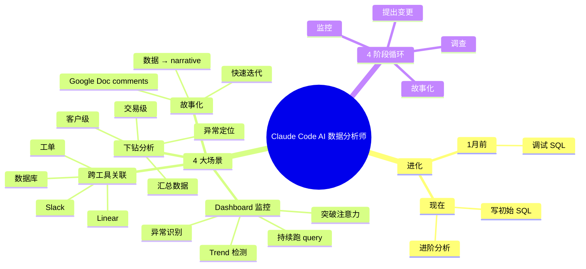

# Claude Code 实战：构建一个 AI 数据分析师

## 一句话总结

深度解析如何用 **Claude Code 复刻数据科学家的思维方式** — 不只是写 SQL，而是构建"监控 → 调查 → 故事化"完整循环，让 AI 帮你处理 dashboard 监测、跨工具上下文关联、数据深挖、以及把发现转化为业务故事。

## 核心洞察

### 1. 从 SQL 调试到完整分析师：AI 的进化

> "A month ago, it was just kind of debugging SQL. Now, AI can really start to write that initial boilerplate SQL query and code that helps you then build on to do more advanced analyses."

**AI 数据能力进化**：
- **1 个月前**：AI 只能 debug SQL
- **现在**：AI 写 boilerplate query + 帮你做进阶分析

### 2. 数据分析师的完整工作循环

> "Recreating the way a data scientist actually thinks inside of a company. They're not just thinking of only the data, they're thinking of all the things outside of that."

**4 阶段工作流**：

1. **监控** — 看现有 dashboard
2. **调查** — 发现 trend 异常时深挖
3. **故事化** — 把数据变成业务能懂的 narrative
4. **提出变更** — 推动决策

### 3. Claude Code 的 4 大应用场景

#### 场景 1：自动化 Dashboard 监控

> "I've set those dashboards up many times in my career and they end up like kind of just getting ignored at some point. Cloud will always read it. Cloud will always kind of start to ask questions."

- AI 跑你的 query、看 trends
- 自动总结哪些 trend 是 meaningful change
- 监控你手动不会看的东西 — **突破人类注意力瓶颈**

#### 场景 2：跨工具上下文关联

> "Cloud does a great job of building out context either through the actual data itself, but also what's going on in Slack, what's going on in these other tools, like linear and tickets that are kind of like being created around that particular topic."

**集成数据源**：
- 数据库 query
- **Slack** 对话（同事在讨论什么）
- **Linear**（相关 tickets）
- **其他工具**（工单、commit 等）

这才是真正的 data person 工作。

#### 场景 3：客户级深挖

> "Let's go into the customer level, let's go into the transaction level and understand is there something out of the norm happening in those trends?"

从汇总数据 → 客户级 → 交易级的**下钻分析**

#### 场景 4：故事化输出

> "Crafting a story with which not all data scientists are good at, you know?"

数据科学家的弱项 — **讲故事**。Claude Code 能帮你：
- 把发现转化为 narrative
- 在 Google Doc 中加 comments
- 快速迭代补充

## 关键概念

| 概念 | 定义 |
|------|------|
| **Boilerplate SQL** | AI 现在能写的初始 SQL 模板 |
| **Dashboard 监控疲劳** | 数据科学家设了 dashboard 但不看（手动疲劳） |
| **跨工具上下文** | 不只查数据，还看 Slack/Linear/工单 等 |
| **下钻分析**（Drill-down） | 从汇总 → 客户级 → 交易级的层级分析 |
| **故事化**（Storytelling） | 把数据发现转化为业务能理解、能行动的 narrative |
| **Trend 异常检测** | AI 主动判断哪些 trend 是 meaningful change |
| **客户级分析** | 深入到单个客户/交易单位 |
| **Background Monitoring Agent** | AI 在后台持续监控 dashboard |

## 实战工作流

```
现有 dashboard
    ↓
AI 持续监控 trend
    ↓
发现异常 trend
    ↓
跨工具关联：Slack + Linear + 工单
    ↓
下钻到客户/交易级
    ↓
Google Doc 写发现
    ↓
业务团队 review
    ↓
推动决策/变更
```

## 思维导图



## 原文金句（英中对照）

> **"A month ago, it was just kind of debugging SQL. Now, AI can really start to write that initial boilerplate SQL query and code that helps you then build on to do more advanced analyses."**
> 译：*一个月前还只能 debug SQL。现在 AI 已经能真的写出初始模板 SQL 查询和代码，让你接着做更进阶的分析。*

> **"Recreating the way a data scientist actually thinks inside of a company. They're not just thinking of only the data, they're thinking of all the things outside of that."**
> 译：*在复刻一个数据科学家在公司里真正的思考方式。他们不仅想数据，还会想数据之外的所有事情。*

> **"I've set those dashboards up many times in my career and they end up like kind of just getting ignored at some point. Cloud will always read it. Cloud will always kind of start to ask questions."**
> 译：*我职业生涯中设过很多 dashboard，最后都被人忽略。Claude Code 总会在意；它总会开始提问。*

> **"Cloud does a great job of building out context either through the actual data itself, but also what's going on in Slack, what's going on in these other tools, like linear and tickets that are kind of like being created around that particular topic."**
> 译：*Claude Code 很擅长构建上下文——不仅来自数据本身，还来自 Slack 在讨论什么、Linear 上有什么 ticket 等其他工具围绕这个主题的动态。*

> **"Crafting a story with which not all data scientists are good at, you know?"**
> 译：*讲故事这件事，说实话不是所有数据科学家都擅长。*

## 行动启示

1. **AI 不只写 SQL** — 它能跑整个监控循环
2. **跨工具是核心** — 数据 + Slack + Linear + 工单 = 完整 context
3. **突破注意力瓶颈** — AI 帮你看那些你手动会忽略的 dashboard
4. **下钻分析是重点** — 从汇总到客户/交易级别
5. **AI 帮你讲故事** — 这是数据科学家的弱项
6. **AI 不替代分析师** — 它做重复工作，你做判断

## 关联笔记

- [[MOC - Agent Theory and Design]] — AI Agent 总索引
- [[MOC - Agent Theory and Design]] — B站视频知识库索引
- [[Cursor副总裁-构建软件开发过程的Agent]] — Cursor 的 STLC Agent 实践
- [[OpenAI官方-Codex新手教程]] — Codex CLI 入门
- [[Claude Code负责人-AI原生团队如何使用AI？]] — Claude Code 团队视角
- [[AI Agent Development]] — AI Agent 开发系统知识

## 来源

- **原始视频**：[BV1Mpf9B5Egk - Claude Code实战：构建一个 AI数据分析师](https://www.bilibili.com/video/BV1Mpf9B5Egk/)
- **UP主**：[Easonlee的AI笔记](https://space.bilibili.com/3546559488723681/upload/video)
- **生成工具**：Recastory（手动 ingest + faster-whisper 转录 + LLM distill）
- **生成日期**：2026-06-10
- **转录模型**：faster-whisper base（en）
- **规范**：英文原文附中文翻译（[[kb-english-chinese-translation|记忆规则]]）
