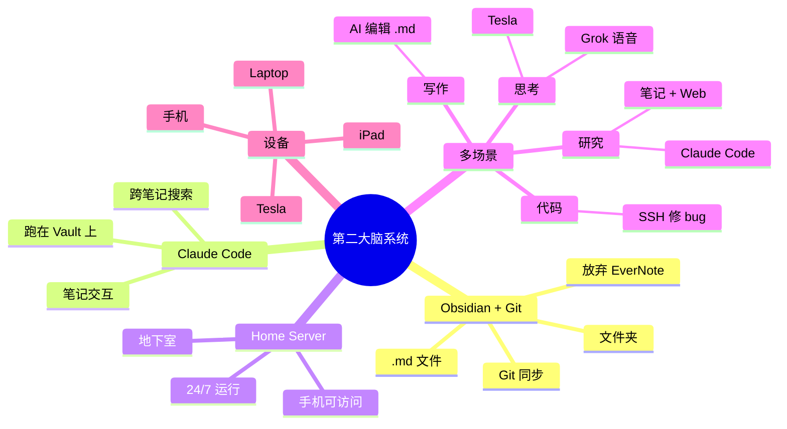

# Claude Code 实战：结合 Obsidian 打造第二大脑

## 一句话总结

Lefic AI Strategy 创始人 **Noah Breyer** 分享他的**极致 Claude Code 第二大脑系统** — 家中地下室自建服务器跑 Claude Code + Obsidian Vault 用 Git 同步 + 用手机/Tesla 上的 Grok 语音模式随时随地**思考、研究、写作、ship 代码**。

## 核心洞察

### 1. Obsidian + Git + Claude Code = 第二大脑

> "Since those days of super organizers, like many people, I've abandoned EverNote and switched over to Obsidian. And one of the big advantages with Obsidian as a note-taking platform is that it's a bunch of markdown files and a bunch of folders. And they can then be synced with Git."

**核心架构**：
- **Obsidian Vault** = 一堆 .md 文件 + 文件夹
- 用 **Git 同步**
- Claude Code 跑在 **Obsidian Vault 之上**
- **最重要的 Claude Code 用法** = 跟笔记交互

> "Probably my number one cloud code use is using it as a tool to interact with my notes."

### 2. 家中服务器 + 手机 = 随时工作

> "My most recent obsession has been standing up a server in my house so that I could also use cloud code on my phone."

**极致设置**：
- 家里跑一台**服务器**（地下室）
- 服务器上跑 Claude Code
- 用**手机**就能访问
- **思考 → 研究 → 写作 → ship 代码** 全在手机上

> "The phone is really just an extension of that same thing... One of the things I find really extraordinary about it is the ability for me to work really productively on my phone."

**核心转变**：手机从"消费设备"变成"生产设备"。

### 3. 三大工作模式

#### 模式 1：通用研究助手
- Claude Code + Obsidian 笔记
- 问笔记里的内容
- 跨笔记搜索

#### 模式 2：手机上 SSH 救火
> "If you see something go wrong, being able to sign in on your phone and have cloud code push a small update to something because you just realize it while you're out is amazing."

- 发现 bug → 立即 SSH
- 让 Claude Code push fix
- 不必等回办公室

#### 模式 3：Grok 语音深度工作
> "I use quite a bit of a GROC voice mode... it's baked into the Tesla."

- 用 **Grok 语音模式**（比他家都强）
- 内置 Tesla
- 车上、路上"深度思考"
- **Tool calling 比其他家好**

### 4. 4 大工作流场景

| 场景 | 用法 | 设备 |
|------|------|------|
| **思考** | Grok 语音对话 | 手机/Tesla |
| **研究** | Claude Code + Obsidian | 任何设备 |
| **写作** | Claude Code 编辑 .md | 任何设备 |
| **代码** | Claude Code push fix | 手机 SSH |

### 5. 知识管理的进化

> "Even the phone wasn't always the best place for doing research and thinking. I felt like my computer was a better place for it, which is why I've been such a sort of note-taker. And I have found whether it's like cloud code and obsidian or I mean, even cloud code and code, right?"

**个人进化路径**：
- EverNote（被放弃）
- → Obsidian + Git（手写笔记）
- → Obsidian + Claude Code（AI 增强）
- → + Home Server（随时访问）
- → + Grok Voice（语音思考）

## 关键概念

| 概念 | 定义 |
|------|------|
| **Second Brain** | 第二大脑（笔记 + AI 共同组成的外部认知系统） |
| **Obsidian Vault** | 一堆 .md 文件 + 文件夹（Git 同步） |
| **Home Server** | 家中自建服务器跑 Claude Code |
| **Grok Voice Mode** | xAI 的语音模式（带 tool calling） |
| **Tesla Grok** | 内置 Grok 语音（开车时深度工作） |
| **Mobile Coding** | 手机 SSH 修代码 |
| **Cloud Code + Obsidian** | AI 与笔记深度集成 |
| **Note Archive** | 跨笔记的全文检索 |

## 实战架构

```
                    📱 手机 / 🚗 Tesla
                    ↓ SSH / Web
                    ↓
              ┌─────────────────┐
              │  Home Server    │
              │  (basement)     │
              │  ┌───────────┐  │
              │  │ Claude    │  │
              │  │   Code    │  │
              │  └─────┬─────┘  │
              └────────┼────────┘
                       ↓
              ┌─────────────────┐
              │  Obsidian Vault │
              │  (Git synced)   │
              │  - .md notes    │
              │  - folders      │
              └─────────────────┘
                       ↓
              ┌─────────────────┐
              │  Multi-device   │
              │  access         │
              │  - iPhone       │
              │  - Laptop       │
              │  - iPad         │
              └─────────────────┘
```

## 思维导图



## 原文金句（英中对照）

> **"Noah Breyer might have the coolest cloud code set up I've ever seen. He rigged a home server in his basement, put his obsidian vault in it, and then runs cloud code on top. So he can think, research, write, and even ship code right from his phone."**
> 译：*Noah Breyer 可能有我见过的最酷的 Claude Code 配置。他在地下室搭了一台家庭服务器，把 Obsidian 库放进去，然后在上面跑 Claude Code。所以他可以直接用手机思考、研究、写作，甚至 ship 代码。*

> **"Probably my number one cloud code use is using it as a tool to interact with my notes."**
> 译：*我最重要的 Claude Code 用法就是把它当作跟笔记交互的工具。*

> **"One of the big advantages with Obsidian as a note-taking platform is that it's a bunch of markdown files and a bunch of folders. And they can then be synced with Git. And you can do lots of other fun kinds of things."**
> 译：*Obsidian 作为笔记平台的一大优势就是它是一堆 Markdown 文件和文件夹，可以用 Git 同步。你还能玩很多其他有趣的事。*

> **"My most recent obsession has been standing up a server in my house so that I could also use cloud code on my phone."**
> 译：*我最近的执念是在家里搭一台服务器，这样我手机上也能用 Claude Code。*

> **"One of the things I find really extraordinary about it is the ability for me to work really productively on my phone. And that's been like a huge, huge change because so much of what I do is sort of writing or coding and the phone is definitely not the best place for that."**
> 译：*我发现它最厉害的一点是让我能在手机上高效工作。这是巨大的改变，因为我的大部分工作都是写作或编程，而手机绝对不是干这些的最佳场所。*

> **"If you see something go wrong, being able to sign in on your phone and have cloud code push a small update to something because you just realize it while you're out is amazing."**
> 译：*如果你发现出了什么问题，能在手机上 SSH 让 Claude Code 推个小更新，因为你出门时突然想到 — 太神奇了。*

> **"I just found GROC's voice mode to be significantly smarter than anybody else is... It does tool calling way better than any of the other ones."**
> 译：*我就是觉得 Grok 的语音模式比谁都聪明。它的 tool calling 比其他家好太多。*

## 行动启示

1. **Obsidian + Git + Claude Code** — 第二大脑的标配组合
2. **放弃 EverNote 等闭源笔记** — 用 .md 文件
3. **Home Server** — 不依赖云服务
4. **手机 SSH 修代码** — 救火不用等回办公室
5. **Grok 语音模式** — 思考不必坐着
6. **Tesla + AI** — 开车时深度工作
7. **设备只是入口** — 数据/服务在云端/家里

## 关联笔记

- [[MOC - Agent Theory and Design]] — AI Agent 总索引
- [[MOC - Agent Theory and Design]] — B站视频知识库索引
- [[OpenAI官方-Codex新手教程]] — Codex 入门
- [[OpenClaw创始人-我是如何使用OpenClaw的？]] — OpenClaw 实战
- [[30分钟精通OpenClaw]] — OpenClaw 入门
- [[IBM团队-Harness工程详解]] — Harness 工程
- [[AI Agent Development]] — AI Agent 开发系统知识
- [[Second Brain Patterns]] — 第二大脑模式（待创建）

## 来源

- **原始视频**：[BV1s2Gd6aEF7 - Claude Code实战：结合Obsidian打造第二大脑](https://www.bilibili.com/video/BV1s2Gd6aEF7/)
- **UP主**：[Easonlee的AI笔记](https://space.bilibili.com/3546559488723681/upload/video)
- **原始播客**：Noah Breyer 在 Greg Eisenberg 播客的访谈
- **生成工具**：Recastory（手动 ingest + faster-whisper 转录 + LLM distill）
- **生成日期**：2026-06-10
- **转录模型**：faster-whisper base（en）
- **规范**：英文原文附中文翻译（[[kb-english-chinese-translation|记忆规则]]）
