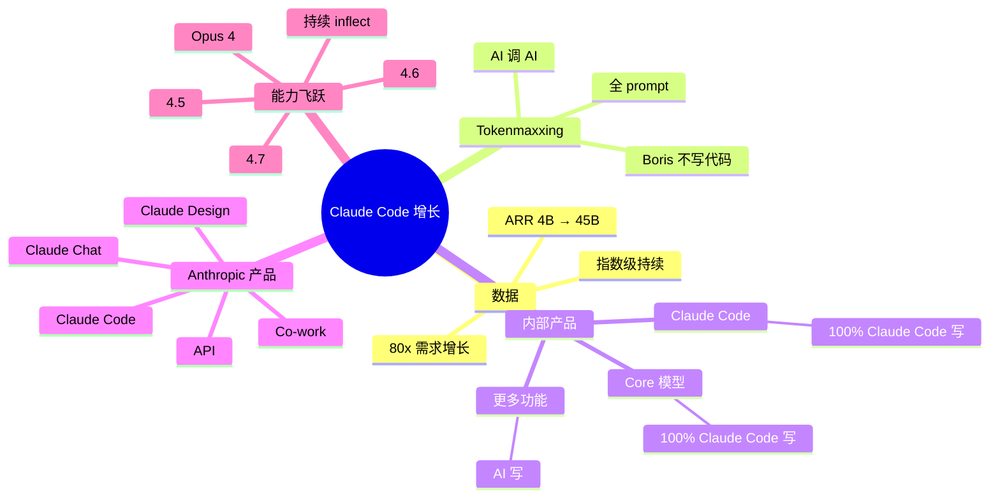

# Claude Code 负责人 Boris Cherny：Tokenmaxxing 与 AI 智能体前沿

## 一句话总结

Claude Code 创始人 **Boris Cherny** 在 Big Technology Podcast 访谈中分享 Claude Code 的**疯狂增长**（Anthropic ARR 10x 增长、80x 需求增长、Opus 4/4.5/4.6/4.7 持续指数级增长）、**Tokenmaxxing 现象**（甚至 Boris 自己都不写代码，而是用 Claude Code 提示另一个 Claude Code），以及 Anthropic 的 AI 产品组合布局。

## 核心洞察

### 1. Claude Code 增长曲线

> "I think at a recent event, Daria Amade, the CEO of Anthropic, talked about how demand for Anthropics products has been up like 80 times a year over year. The numbers right now say maybe it's 45 billion, right? So a 10X there, 80X demand, and the question is, how fast the company can serve the demand here."

**Anthropic 增长数据**：
- ARR：**$4B → $45B**（10x）
- 需求：**80x** 年同比增长
- 关键转折：Opus 4（5 月）→ Opus 4.5（11 月）→ 4.6（2 月）→ 4.7（持续）

> "I've just never seen growth this deep. And then you just kept going more and more exponential with Opus 4.5, those in November, and then 4.6, those February of this year, and then 4.7, you just keep inflecting over and over."

### 2. Tokenmaxxing 现象

> "I don't write code. I prompt Quad. And actually nowadays, mostly what I'm doing is I have a Quad that prompts other Quad. So I don't even talk to Quad. I have a Quad that's talking to my Quad."

**惊人现象**：
- Boris **自己不写代码**
- 全部**用 prompt 让 Claude Code 工作**
- 甚至：**让一个 Claude Code 提示另一个 Claude Code**
- "Tokenmaxxing" — 最大化 token 使用

> "Quad code is 100% written by Quad code. Coreq is 100% written by Quad code. An increasing number of features are fully written by Quad code across Anthropic and products."

**Anthropic 内部**：
- Claude Code：100% 由 Claude Code 写
- Core Claude 模型：100% 由 Claude Code 写
- 越来越多功能完全 AI 写

### 3. Claude Code 是 Anthropic 的"产品门面"

> "For a lot of people, Quad code is their first introduction. And yeah, the growth has just been insane."

**产品矩阵**：
- Claude Code（CLI agent）
- Claude AI Chat（消费）
- Claude Design（设计）
- Co-work（协作）
- API（开发者）

**入门路径**：很多人通过 Claude Code 第一次接触 Anthropic。

### 4. 增长背后：产品能力飞跃

> "Around the time that we released Opus 4 and Sonnet 4, this was in May of last year, the growth just went exponential."

**能力飞跃节点**：
- **Opus 4 / Sonnet 4**（5 月）— 增长开始指数级
- **Opus 4.5**（11 月）— 持续翻倍
- **Opus 4.6**（2 月）— 持续
- **Opus 4.7** — 又一次"inflect"

### 5. 内部产品自我编写

> "An increasing number of features are fully written by Quad code across Anthropic and products."

**递归自我改进**：
- 产品用 AI 写自己的代码
- 这是 AI Native 公司的真实写照

## 关键概念

| 概念 | 定义 |
|------|------|
| **Boris Cherny** | Claude Code 创始人（Anthropic 工程师） |
| **Tokenmaxxing** | 最大化使用 token（甚至让 AI 调 AI） |
| **AI Native** | 完全由 AI 写代码的公司 |
| **Anthropic ARR** | Anthropic 年度经常性收入 |
| **Opus 4 / 4.5 / 4.6 / 4.7** | Anthropic 模型系列 |
| **Co-work** | Claude 协作产品 |
| **Quadrant Code** | Claude Code 的口语化称呼 |
| **Inflecting** | 曲线转折点（指数级增长） |
| **Recursive Self-Improvement** | 递归自我改进（AI 写 AI 代码） |

## 增长时间线

```
2024
  5月: Opus 4 / Sonnet 4 发布
       → 增长开始指数级
11月: Opus 4.5
       → 持续翻倍
2025
  2月: Opus 4.6
       → 持续
       Opus 4.7
       → 又一次 "inflect"
```

## 思维导图



## 原文金句（英中对照）

> **"I don't write code. I prompt Quad. And actually nowadays, mostly what I'm doing is I have a Quad that prompts other Quad. So I don't even talk to Quad. I have a Quad that's talking to my Quad."**
> 译：*我不写代码。我用 prompt 让 Claude 工作。实际上现在我大部分时候是在用一个 Claude 去提示另一个 Claude。我甚至不直接跟 Claude 说话。我有个 Claude 在跟我的 Claude 说话。*

> **"Quad code is 100% written by Quad code. Coreq is 100% written by Quad code. An increasing number of features are fully written by Quad code across Anthropic and products."**
> 译：*Claude Code 100% 由 Claude Code 写。核心 Claude 模型 100% 由 Claude Code 写。Anthropic 越来越多产品功能也完全由 Claude Code 写。*

> **"I've just never seen growth this deep. And then you just kept going more and more exponential with Opus 4.5, those in November, and then 4.6, those February of this year, and then 4.7, you just keep inflecting over and over."**
> 译：*我从来没见过这么深的增长。然后一直保持指数级——Opus 4.5 去年 11 月、4.6 今年 2 月、然后 4.7——曲线一次次转折。*

> **"For a lot of people, Quad code is their first introduction. And yeah, the growth has just been insane."**
> 译：*对很多人来说，Claude Code 是他们接触 Anthropic 的第一站。增长简直疯狂。*

> **"There's a lot of different products. There's Quad code, there's Quad AI chat, there's Quad design, there's co-work, there's API products. There's a lot of waste to experience Anthropic. But for a lot of people, Quad code is their first introduction."**
> 译：*我们有好多产品——Claude Code、Claude AI Chat、Claude Design、Co-work、API 产品。体验 Anthropic 的方式太多了。但对很多人来说，Claude Code 是他们的入门点。*

## 行动启示

1. **Tokenmaxxing 是新常态** — 最大化用 token，让 AI 互相调用
2. **Boris 自己也"不写代码"** — 这是 AI Native 的标志
3. **100% AI 写代码** — Anthropic 内部已经是这状态
4. **指数级增长持续** — Opus 4.5/4.6/4.7 持续翻倍
5. **入门路径重要** — Claude Code 是 Anthropic 门面
6. **AI Native 公司** — 产品用 AI 写自己
7. **Recursion 自我改进** — 短期就是现实

## 关联笔记

- [[MOC - Agent Theory and Design]] — AI Agent 总索引
- [[MOC - Agent Theory and Design]] — B站视频知识库索引
- [[Cursor副总裁-构建软件开发过程的Agent]] — Cursor 副总裁视角
- [[Claude Code负责人-AI原生团队如何使用AI？]] — Claude Code 团队 Cat
- [[OpenAI官方-Codex新手教程]] — Codex 入门
- [[Karpathy爆火项目-AutoResearch解读与启发]] — AutoResearch
- [[AI Agent Development]] — AI Agent 开发系统知识
- [[AI Native Company]] — AI Native 公司（待创建）

## 来源

- **原始视频**：[BV1NuGU6yE1b - Claude Code负责人 Boris Cherny：疯狂增长、Tokenmaxxing 与 AI 智能体的下一个前沿](https://www.bilibili.com/video/BV1NuGU6yE1b/)
- **UP主**：[Easonlee的AI笔记](https://space.bilibili.com/3546559488723681/upload/video)
- **原始播客**：Big Technology Podcast 访谈
- **生成工具**：Recastory（手动 ingest + faster-whisper 转录 + LLM distill）
- **生成日期**：2026-06-10
- **转录模型**：faster-whisper base（en）
- **规范**：英文原文附中文翻译（[[kb-english-chinese-translation|记忆规则]]）
