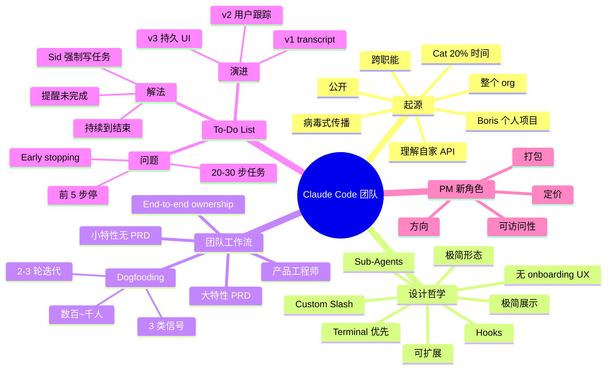

# Claude Code 负责人：AI 原生团队如何使用 AI？

## 一句话总结

Claude Code 产品负责人 **Cat** 深入分享 Claude Code 团队内部如何工作 — 包括起源故事（Boris 个人项目 → 内部病毒式传播 → 公开）、设计哲学（终端优先、极简、深度可扩展）、产品决策流程（工程师驱动、内部 dogfooding、PRD-free 的小特性）、以及"待办列表（To-Do List）"的诞生 — 一个强制 Model 写任务的优雅设计，让 20-30 步的重构任务不再半途而废。

## 核心洞察

### 1. 起源故事

- **Boris 个人项目** — 他想理解 Anthropic 自家 API，看自己能在软件工程中"augment"多少
- **Cat 20% 时间贡献** — 当时在加 internal environments，发现 Claude Code 让效率大幅提升
- **病毒式传播** — Boris 团队 → 整个 org → 研究院 → 跨职能（数据科学、PM、设计师）
- **决定公开发布** — Cat 全职加入 PM 角色
- **未来方向**：feature 更丰富、跨异构开发环境、更易用

> "It had a very high viral factor internally before we launched it."

### 2. 终端优先的设计哲学

> "The beauty of the terminal is that through the terminal, Cloud Code can access almost everything that's involved or can."

**5 大设计原则**：

1. **终端可访问一切** — GitHub CLI、Data Docs CLI 等用户已熟悉的工具，Claude Code 都能调用
2. **极简形态** — 没有按钮，没有花哨 UI
3. **新特性无 onboarding** — "For new features, there should be no onboarding UX. It should be intuitive via the feature name, via like a one line of description."
4. **极简** — 受限于 ASCII 字符，团队对展示什么非常"残忍"
5. **可扩展** — hooks、custom slash commands、sub agents 等

> "Make it very simple to get started, but able to handle complexity over time."

### 3. 团队工作流：工程师驱动

- 团队是"产品工程师" — 喜欢 end-to-end ownership
- **没有 PRD 流程的小特性**：to-do list、plan mode 等是工程师 prototype → dogfooding → 公开
- **有 PRD 的大特性**：Claude 4 + VS Code/IntelliJ 集成（明确战略决策）
- PM 角色：在 AI 时代主要负责 **方向、定价、打包、accessibility**

> "It's tricky to be a PM for a developer product because at the end of the day, the developer is the end user."

### 4. Dogfooding 文化

- 几百（现在上千）内部员工日常使用
- 听到反馈的 3 类信号：
  1. 用户立即理解 → 好
  2. 用户困惑或有 bug → 改进
  3. 用户狂爱 → 加速发布
- 一个特性公开前通常经过 2-3 轮内部迭代

### 5. To-Do List 的诞生

**问题**：用户用 Claude Code 做大型重构（重命名变量、20-30 步任务），经常**前 5 步做完就停了**（early stopping）。

**Sid 的解法**：强制 Model **写下任务清单** — 像人类一样。

> "Just by forcing the model to write down his tasks and reminding it, hey, you can't stop until the tasks are done, this actually forced the model to go through and do all 20 or 30 items without any early stopping."

**演进**：
- v1：Claude Code 把 todo list 写在 transcript 里，飞快闪屏
- v2：用户开始**用 todo list 跟踪 Model 进度**
- v3：变成持久化 UI 组件

### 6. Why Cat loves Terminal

> "If you're used to calling like the GitHub CLI or the data docs CLI or literally any CLI tool, you immediately know that Cloud Code can do it."

- 极简（只有 ASCII）
- 没有 onboarding UX
- 极简的"展示什么"决策
- 极深的功能深度（一旦你发现）

## 关键概念

| 概念 | 定义 |
|------|------|
| **Claude Code** | Anthropic 的 CLI coding agent，Cat 是产品负责人 |
| **Boris** | Claude Code 的原始创建者（Anthropic 工程师） |
| **Cat** | Claude Code 产品负责人（PM Lead） |
| **Product Engineer** | Claude Code 团队的核心角色 — end-to-end ownership |
| **Dogfooding** | 内部员工日常使用，收集反馈 |
| **To-Do List** | 强制 Model 写任务的特性，让 20-30 步任务不中断 |
| **Hooks** | Claude Code 的扩展机制之一 |
| **Sub-Agents** | Claude Code 的扩展机制之一 |
| **Custom Slash Commands** | Claude Code 的扩展机制之一 |
| **Terminal-First** | 终端优先的设计哲学 |
| **No Onboarding UX** | 特性应通过名称 + 一行描述自解释 |
| **Plan Mode** | Claude Code 的一种模式（与 to-do list 相关） |

## 实战最佳实践

### Dogfooding 流程

```
工程师 prototype
    ↓
内部 dogfooding（数百~千人）
    ↓
3 类信号反馈
    ↓
    1. 理解清晰 ✓
    2. 困惑/bug → 改进
    3. 狂爱 → 加速发布
    ↓
公开（经过 2-3 轮迭代）
```

### 决策框架

| 特性类型 | 决策流程 | 例子 |
|---------|---------|------|
| **小特性** | 工程师 prototype → dogfooding → 公开 | To-Do List, Plan Mode |
| **大特性** | PRD + 产品评审 + 长期开发 | Claude 4 + IDE 集成 |

### PM 角色新定义（AI 时代）

| 传统 | AI 时代 |
|------|--------|
| 写需求 | 设方向 |
| 协调开发 | Shepherding 流程 |
| 关注功能 | 关注**定价 + 打包** |
| 内部协作 | 关注**可访问性** |

## 思维导图



## 原文金句（英中对照）

> **"Cloud code started as a project that Boris was tinkering with to better understand our APIs and to see how much of software engineering he could augment."**
> 译：*Claude Code 起源于 Boris 用来更好地理解我们自家 API 的小项目，他想看看自己能在软件工程中"augment"多少。*

> **"It had a very high viral factor internally before we launched it."**
> 译：*它在正式发布前就有非常高的内部病毒传播因子。*

> **"The beauty of the terminal is that through the terminal, Cloud Code can access almost everything that's involved or can."**
> 译：*终端的美妙之处在于，通过终端 Claude Code 能访问几乎所有涉及的东西。*

> **"For new features, there should be no onboarding UX. It should be intuitive via the feature name, via like a one line of description, what it does."**
> 译：*对于新功能，不应该有 onboarding UX。它应该通过功能名称、一行描述就自解释清楚它是干嘛的。*

> **"Make it very simple to get started, but able to handle complexity over time."**
> 译：*上手要极简，但能随着时间处理复杂任务。*

> **"A lot of our best features was like an engineer prototyping an idea, shipping it to dog fooding, which is so that hundreds at this point, maybe like a thousand internal employees can try it out. And we just hear what the feedback is."**
> 译：*我们很多最好的功能都来自：工程师 prototype 一个点子，ship 给内部 dogfooding — 现在有几百到上千内部员工可以使用 — 我们听反馈。*

> **"It's tricky to be a PM for a developer product because at the end of the day, the developer is the end user."**
> 译：*为开发者产品做 PM 很难，因为最终用户就是开发者。*

> **"Just by forcing the model to write down his tasks and reminding it, hey, you can't stop until the tasks are done, this actually forced the model to go through and do all 20 or 30 items without any early stopping."**
> 译：*仅仅是强制 Model 写下任务、提醒它"任务没完成不能停"，就足以让 Model 完成全部 20-30 项任务，不再 early stopping。*

> **"A lot of people, we noticed that a lot of people were actually just using a to-do list to track the model's progress."**
> 译：*我们注意到很多人实际上是用 to-do list 来跟踪 Model 的进度。*

## 行动启示

1. **个人项目可以改变世界** — Boris 的小工具 → Claude Code
2. **终端仍是 Agent 的最佳形态** — 极简、可访问一切、无 onboarding
3. **Dogfooding > PRD** — 让工程师 prototype + 内部试用，比写需求更高效
4. **强制 Model 自我跟踪** — To-Do List 是 20-30 步任务的关键
5. **PM 角色在重塑** — 从写需求到定方向、定价、打包
6. **极简可扩展** — 简单上手，但能处理复杂场景
7. **跨职能 AI 助手** — Claude Code 不只给开发者用，PM、设计师、数据科学都用

## 关联笔记

- [[MOC - Agent Theory and Design]] — AI Agent 总索引
- [[MOC - Agent Theory and Design]] — B站视频知识库索引
- [[Cursor副总裁-构建软件开发过程的Agent]] — Cursor 副总裁视角
- [[OpenAI官方-Codex新手教程]] — Codex CLI 入门
- [[OpenClaw 创始人-我是如何使用OpenClaw的？]] — OpenClaw 创始人视角
- [[AI Agent Development]] — AI Agent 开发系统知识
- [[Claude Code]] — Claude Code 项目（待创建）
- [[To-Do List Pattern]] — AI 自我跟踪模式（待创建）

## 来源

- **原始视频**：[BV1eyBgB2EbX - Claude Code负责人：AI 原生团队如何使用AI？](https://www.bilibili.com/video/BV1eyBgB2EbX/)
- **UP主**：[Easonlee的AI笔记](https://space.bilibili.com/3546559488723681/upload/video)
- **原始播客**：Cat (Claude Code PM Lead) 在 Latent Space 访谈
- **生成工具**：Recastory（手动 ingest + faster-whisper 转录 + LLM distill）
- **生成日期**：2026-06-10
- **转录模型**：faster-whisper base（en）
- **规范**：英文原文附中文翻译（[[kb-english-chinese-translation|记忆规则]]）
