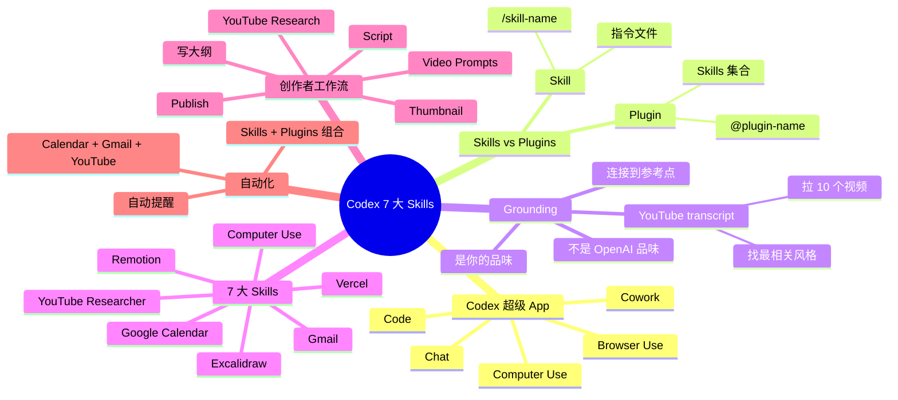

# Codex 实战：构建全能 AI 营销团队

## 一句话总结

一位拥有 150 万粉丝的创作者分享他的 **Codex 7 大 Skills + Plugins 实战** — 用 Codex 作为"超级 App"（结合 chat + cowork + code），通过"接地"（grounding）AI 模型到他自己的品味/参考点上，让 95% 的营销任务自动化，目标年底达到 1000 万粉丝。

## 核心洞察

### 1. Codex 是"超级 App"

> "Codex is OpenAI's brand new super app. And the reason I'm able to use AI agents for almost all of my marketing tasks is because I've built a layer of skills around Codex."

**Codex vs Claude Desktop**：
- Claude Desktop：chat + cowork + Claude code（分开）
- **Codex**：三者**整合**为一个体验

**Codex 能做的事**：
- 生成 slide decks
- 生成 spreadsheets（在 spreadsheet 中工作）
- 生成完整文档
- 生成任何类型 app 或 web 页面
- 完整控制你的电脑（computer use）
- 浏览器控制（browser use）

### 2. Skills vs Plugins

> "You can think of plugins as bundles of skills and abilities. And you can think of skills as instruction files for an AI agent."

| 类型 | 定义 | 用法 |
|------|------|------|
| **Skill** | AI agent 的指令文件 | `/skill-name` |
| **Plugin** | 多个 skills 的集合 | `@plugin-name` 或 `at sign` |

**示例**：
- `@Vercel` → 提到 Vercel plugin
- `/Vercel Sandbox` → 调用 Vercel plugin 下的 Sandbox skill
- 插件会自动选对 skill

### 3. 7 大 Skills（部分）

#### Skill 1-2：Grounding（接地）

> "What grounding is is basically connecting your AI agent to a useful reference point."

**问题**：ChatGPT 输出是 OpenAI 训练数据的"品味"，**不是你的品味**。

**解法**：给 Agent 一个**高质量参考点**。

**最佳参考：YouTube**（让 Agent 拉创作者的视频 transcript）

> "If you've used ChatGPT before and you ask it to create content or come up with an outline for a YouTube video... it's not grounded in anything useful for you. Depending on your niche or depending on who you are, you might have a specific taste that you like. And so what you want to do is you want to actually ground the model or point your AI agent at a place where they can find a high quality example."

#### Skill 示例

| Skill | 作用 |
|-------|------|
| **YouTube Researcher** | 拉 YouTuber 视频 transcript 找风格 |
| **Excalidraw Diagram** | 自动画架构图 |
| **Remotion Best Practices** | 视频生成最佳实践 |
| **Vercel Sandbox** | 一键部署应用 |

### 4. 创作者工作流（95% 自动化）

```
1. 写大纲（手工）
        ↓
2. /youtube-researcher - 拉 10 个目标 YouTuber 视频
        ↓
3. AI 找出最相关的风格
        ↓
4. /script - 生成脚本（用对应 YouTuber 风格）
        ↓
5. /video-prompts - 生成视频 prompt
        ↓
6. /thumbnail - 生成缩略图
        ↓
7. /publish - 一键发布
```

### 5. 7 大 Skill（视频中提到）

作者在 chorus.com/skills 上列出了他用的 7 大 skill，包括：
1. **YouTube Researcher**（内容接地）
2. **Excalidraw**（架构图自动）
3. **Remotion**（视频生成）
4. **Google Calendar**（plugin）
5. **Gmail**（plugin）
6. **Vercel**（plugin，部署）
7. **Computer Use**（plugin）

### 6. 自动化 = Skills + Plugins

> "Automations can actually be used with skills and plugins. They kind of go together."

**示例**：
- Google Calendar + Gmail + YouTube Researcher
- 自动根据 YouTube 视频生成内容 → 自动发邮件提醒

## 关键概念

| 概念 | 定义 |
|------|------|
| **Codex** | OpenAI 的超级 App（chat + cowork + code 整合） |
| **Grounding** | 把 AI 模型连接到具体参考点的技术 |
| **Skill** | AI agent 的指令文件（Markdown 形式） |
| **Plugin** | 多个 skills 的集合 |
| **Computer Use** | Agent 控制电脑的能力 |
| **Browser Use** | Agent 控制浏览器的能力 |
| **YouTube Researcher** | 用 YouTube transcript 接地内容的 skill |
| **Vercel Sandbox** | 一键部署 web app 的 plugin |
| **@plugin-name** | 提及 plugin 的语法 |
| **/skill-name** | 调用具体 skill 的语法 |

## 实战工作流

### 内容创作完整工作流

```
Step 1: /youtube-researcher
  - 输入：目标 YouTuber + 我的主题
  - 拉取最新 10 个视频
  - 找出最相关的风格参考
  
Step 2: /script  
  - 输入：风格 + 大纲
  - 生成完整脚本
  
Step 3: /video-prompts
  - 输入：脚本
  - 生成每个镜头的视频 prompt
  
Step 4: /thumbnail
  - 输入：视频主题
  - 生成缩略图 prompt
  
Step 5: /publish
  - 整合所有资产
  - 一键发布
```

### 接地（Grounding）vs 不接地

| 类型 | 效果 |
|------|------|
| **不接地** | "请帮我写个 YouTube 脚本" → 输出通用模板（OpenAI 训练的品味） |
| **接地（YouTube）** | "请参考 Theo 的风格写脚本" → AI 拉 10 个 Theo 视频 → 学到他的 hook 结构 → 输出匹配风格 |

## 思维导图



## 原文金句（英中对照）

> **"Yesterday, I was working on my laptop and I realized that 95% of the tasks that I do on my computer or content and marketing is inside Codex. And Codex is OpenAI's brand new super app."**
> 译：*昨天我在笔记本上工作时意识到，95% 的电脑任务——内容、创作、营销——都在 Codex 里完成。Codex 是 OpenAI 全新的超级 App。*

> **"The reason I'm able to use AI agents for almost all of my marketing tasks is because I've built a layer of skills around Codex. These are repeatable workflows that I use every single day to help me go from 1.5 million followers to hopefully 10 million followers by the end of next year."**
> 译：*我能用 AI agent 完成几乎所有营销任务，是因为我在 Codex 周围建了一层 skills。这些是我每天用的可重复工作流，帮我从 150 万粉丝到明年年底冲 1000 万。*

> **"What grounding is is basically connecting your AI agent to a useful reference point."**
> 译：*Grounding 本质上就是把 AI agent 接到一个有用的参考点上。*

> **"If you've used ChatGPT before and you ask it to create content... it's not grounded in anything useful for you. Depending on your niche or depending on who you are, you might have a specific taste that you like."**
> 译：*如果你用过 ChatGPT，让它写内容... 它对你没做任何 grounding。取决于你的领域和你是谁，你可能有自己偏爱的特定品味。*

> **"You can think of plugins as bundles of skills and abilities. And you can think of skills as instruction files for an AI agent."**
> 译：*你可以把 plugin 想象成 skills 和能力的集合，把 skill 想象成 AI agent 的指令文件。*

> **"While you're using codecs, there's two commands that you should be aware of when using skills. The first one is a skill. So if you want to use a skill that you've already created, you can press slash. And... I can also use plugins by pressing the at sign."**
> 译：*用 Codex 时有两个命令要知道。第一个是 skill——用 `/` 调起已有的 skill。我也可以用 `@` 调起 plugin。*

## 行动启示

1. **Codex 是超级 App** — chat + cowork + code 一个搞定
2. **Skill 是一等公民** — 围绕 Codex 建 skills 层
3. **Grounding 是关键** — 让 AI 用你的品味而非 OpenAI 品味
4. **YouTube 是最好接地源** — 拉真实创作者 transcript
5. **Plugin = Skills 集合** — 复用而非每次造轮子
6. **每天用 = 95% 自动化** — 内容、营销都能搞定
7. **从 chorus.com/skills 找灵感** — 社区共享 skills

## 关联笔记

- [[MOC - Agent Theory and Design]] — AI Agent 总索引
- [[MOC - Agent Theory and Design]] — B站视频知识库索引
- [[OpenAI官方-Codex新手教程]] — Codex 官方入门
- [[Claude Code实战-构建一个AI数据分析师]] — Claude Code 实战
- [[Taven创始人-将OpenClaw嵌入产品的实战经验]] — Skills 架构
- [[Agent实战-打造一个AI Agent的完整教程]] — Agent 入门
- [[AI Agent Development]] — AI Agent 开发系统知识

## 来源

- **原始视频**：[BV1BLGH6REyX - Codex实战：构建全能AI营销团队](https://www.bilibili.com/video/BV1BLGH6REyX/)
- **UP主**：[Easonlee的AI笔记](https://space.bilibili.com/3546559488723681/upload/video)
- **生成工具**：Recastory（手动 ingest + faster-whisper 转录 + LLM distill）
- **生成日期**：2026-06-10
- **转录模型**：faster-whisper base（en）
- **规范**：英文原文附中文翻译（[[kb-english-chinese-translation|记忆规则]]）
