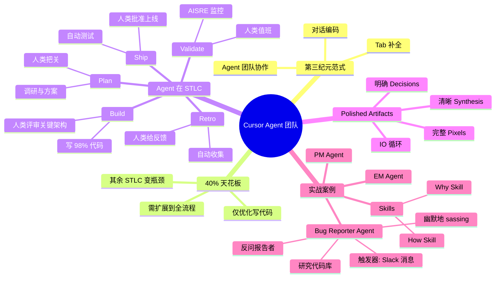

# Cursor 副总裁：构建软件开发过程的 Agent

## 一句话总结

Cursor 副总裁分享如何构建工程团队中"人类 × Agent"协作的第三纪元 — 突破 40% 生产力天花板的关键不在写代码，而在把 Agent 嵌入完整的 STLC（计划 / 构建 / 发布 / 验证 / 复盘），并通过精心设计的 artifacts 让人类在每个关键节点做高价值判断。

## 核心洞察

### 1. 40% 生产力天花板

- **2025 年初**：企业内 AI 写代码比例从 0% 暴涨到 15-20%，部分先锋公司 98% 的 merged commits 由 AI 写。
- **客户反馈**：上线 Cursor 一年后增长出现"高原" — 平均约 40% 生产力提升，难以继续上升。
- **原因**：只优化了"写代码"这一环，而 R&D 预算 60-80% 其实花在手工编码上；其余 STLC 环节（规划、架构评审、发布、运维、复盘）反而成为新瓶颈。

### 2. 第三纪元：Agent 团队 > Coding Assistant

| 时代 | 范式 | 描述 |
|------|------|------|
| 时代 1 | 代码补全（Code Completion） | Tab 自动补全 |
| 时代 2 | 编码助手（Coding Assistant） | Cursor 风格的对话式编码 |
| **时代 3** | **Agent 团队（Agent Teams）** | **人类 + 一组 Agents 协作，覆盖整个 STLC** |

### 3. 人类在 STLC 中仍不可或缺的环节

> **"What are the things we still want humans to do?"**
> 译：*我们仍然希望人类做哪些事情？*

| 阶段 | 人类工作 | Agent 工作 |
|------|----------|-----------|
| **Plan（计划）** | 审核 rigorous plan（严谨的方案），决定是否投入构建 | 用户访谈、市场调研、方案探索 |
| **Build（构建）** | 关键架构决策、关键代码段、demo 评审 | 撰写绝大部分代码、20k 行 PR |
| **Ship（发布）** | 批准上线 | 自动化测试、CI |
| **Validate（验证）** | 值班 / PagerDuty | AISRE 监控、运行中运维 |
| **Retro（复盘）** | 给反馈、迭代 | 收集 outcome（结果数据）、建议改进 |

**核心论点**：人类保留的是**高价值判断点**（签字、把关、关键 review），而不是每一个步骤。

### 4. Agent 系统的产出物：Polished Artifacts（精修产物）

理想中 Agent 系统产出的不只是代码，而是：

1. **清晰的工作总结**（synthesis，合成）— Agent 做了什么
2. **明确的决策请求**（decisions，决策点）— 需要人类做什么判断
3. **完整的可视化**（pixels，视觉呈现）— 让人类"看见" Agent 在提议什么
4. **高质量 IO 循环** — 人类能给出高保真反馈，Agent 能接收并迭代

> **"More and more as we think about the new iteration of the cursor IDE, we're thinking about making sure it's this amazing system for reviewing these polished artifacts and also giving feedback to them and learning from that feedback."**
> 译：*随着我们思考 Cursor IDE 的下一次迭代，我们越来越关注的是：把它打造为一个能审阅这些精修产物、并对它们给出反馈、同时从反馈中学习的卓越系统。*

## 关键概念

| 概念 | 定义 | 在 Cursor 的实践 |
|------|------|------------------|
| **STLC**（Software Testing/Development Life Cycle） | 软件测试/开发生命周期 | 完整软件生命周期：plan → build → ship → validate → retro |
| **Polished Artifact**（精修产物） | Agent 产出的供人类审阅的高保真产物 | 包含 synthesis、decisions、pixels 三要素 |
| **Skill** | 教 Harness 如何更严格地检查代码的模块 | "How Skill"、"Why Skill" |
| **Harness** | 围绕模型构建的工程系统 | 包含 Skills、System Prompt、工具调用 |
| **Cloud Agent**（云端 Agent） | 在云端运行、可被指令触发的 Agent | "I've got a guy on it"（我派了个人去干）— 团队内部玩笑 |
| **AISRE**（AI Software Reliability Engineer） | AI 软件可靠性工程师 | 在生产环境自动运维的 Agent |
| **Dog Fooding**（自家狗粮） | 内部员工先用自家产品 | 全员被要求用 Glass 报告问题 |
| **Rigorous Plan**（严谨方案） | 经过严格论证的实施方案 | 在 Plan 阶段由人类最终把关 |

## 实战案例：PM Agent & EM Agent

### 起源：Lauren 观察到的"卡顿"

- 团队内部有 Slack 频道 `Issues Glass`，每天 10-20 条 issue
- Lauren 是 on-call 工程师，发现"cloud agent"经常被叫去修 bug 但**没真正解决**
- 猜测：bug 报告本身质量差（vague thing — *"含糊其辞"*），没有足够细节

### 解决方案：Bug Reporter Agent（Bug 报告者 Agent）

1. **触发**：Slack 消息
2. **行为**：
   - 在代码库中研究相关代码
   - 反过来向 bug 报告者提更多问题
   - 几分钟后回来"怼"报告者要更多细节
3. **效果**：
   - bug 报告质量大幅提升
   - 部分问题被自动解答（support ticket — *"客服工单"*性质）
   - 部分被识别为 feature request（功能请求）
   - 有时会幽默地"怼"sassing（"sassing"意为俏皮地顶嘴/回嘴）报告者

### PM Agent & EM Agent：再上层的合成

在 bug 报告被整理好后：
- **PM Agent（产品经理 Agent）**：合成 issue 群、形成计划
- **EM Agent（工程经理 Agent）**：决策、分配、跟进

> **"It's just one more layer of synthesis on this."**
> 译：*这只是在已有工作之上多加一层综合。*

### 关键 Skills

| Skill | 作用 |
|-------|------|
| **How Skill**（"如何做"技能） | 教 Harness 如何更严格地检查代码（how to inspect） |
| **Why Skill**（"为什么"技能） | 教 Harness 如何更深入地解释代码的"为什么"（why something is happening） |

## 思维导图

## 原文金句（英中对照）

> **"We've gone from zero amount of code being written by AI at the beginning of 2025 to as Michael said about 15-20% across the enterprise. It has skyrocketed."**
> 译：*从 2025 年初企业内 AI 写代码的比例为零，到现在如 Michael 所说大约 15-20%，涨势已经一飞冲天。*

> **"In fact, at more forward leaning companies such as ourselves is about 98% of merged commits are being written by AI."**
> 译：*事实上，在像我们这样更前沿的公司，大约 98% 的合并提交（merged commits）都是由 AI 写的。*

> **"Many folks are kind of stuck in this 40-ish percent throughput improvement. I think this is actually like a fundamental limit of like using coding assistance in phase two."**
> 译：*很多人卡在 40% 左右的吞吐提升上。我觉得这其实是"在第二阶段用编码助手"的根本性上限。*

> **"I think this threshold problem that we have fundamentally is a problem that we've only replaced like a tiny part of the STLC and we found all of these new bottlenecks."**
> 译：*我认为我们面临的这个阈值问题，本质上是我们只替换了 STLC 中很小一部分，结果在其他环节发现了所有这些新瓶颈。*

> **"What are the things we still want humans to do?"**
> 译：*我们仍然希望人类做哪些事情？* — 视角反转：先问人类该做什么，再围绕此设计 Agent。

> **"She had an interesting idea which is like well I wonder what would happen if I got a little bit more rigorous on these reports."**
> 译：*她有了一个有趣的想法 — 我想看看如果我对这些 bug 报告再严谨一些，会发生什么。* — Lauren 创造 PM/EM Agent 的起点。

> **"It's almost like the bug reporter agent is kind of sassing the person who reported the bug and we're getting like a lot more detail."**
> 译：*几乎就像是 bug 报告者 Agent 在俏皮地回嘴那个报告 bug 的人，而我们则因此获得了多得多的细节。* — 幽默的反馈循环。

> **"I think one of the really useful things is to actually think about it from the other direction which is what are all of the human steps in this new world?"**
> 译：*我觉得真正有用的一点是：换个方向思考 — 在这个新世界里，人类的所有步骤都是什么？*

> **"I kind of like to think of it like this. Where intelligence is the models, the harness, a lot of what has made this AI revolution possible. Then we have the humans at the top..."**
> 译：*我喜欢这样想：底层是 intelligence — 模型、Harness 以及让这场 AI 革命成为可能的一切；顶层是人类...中间则是我们需要构建的 Agent 团队。*

## 行动启示

1. **不要只优化写代码** — 看整个 STLC，找到新瓶颈
2. **从人类工作反推 Agent 设计** — 先问"人类还要做什么"，再设计 Agent
3. **每个 Agent 都应产出 polished artifacts** — 让人类能快速 review
4. **IO 循环是关键** — 人类高保真反馈 + Agent 接收并迭代
5. **Skills 是 Harness 的核心** — 像 "How Skill"、"Why Skill" 这样的小模块能极大提升 Agent 质量
6. **Bug Reporter Agent 模式可复用** — 让 Agent 反过来"采访"人类，强制提升信息质量

## 关联笔记

- [[MOC - Agent Theory and Design]] — 总索引
- [[MOC - Agent Theory and Design]] — B站视频知识库索引
- [[Codex 自我改进 Prompt]] — OpenAI 类似的 Skill/Automation 固化思路
- [[别再搭 Harness 了，先把你的痛点解决，用最笨的方式]] — 痛点先于系统的工程思维
- [[AI Agent Development]] — AI Agent 开发的系统知识
- [[Workflow and Skill Management]] — Skill 与工作流管理

## 来源

- **原始视频**：[BV1MQVf6SEST - Cursor副总裁：构建软件开发过程的Agent](https://www.bilibili.com/video/BV1MQVf6SEST/)
- **UP主**：[Easonlee的AI笔记](https://space.bilibili.com/3546559488723681/upload/video)
- **生成工具**：Recastory（手动 ingest + faster-whisper 转录 + LLM distill）
- **生成日期**：2026-06-09
- **转录模型**：faster-whisper base（zh，474 segments）
- **规范**：英文原文附中文翻译（[[kb-english-chinese-translation|记忆规则]]）
