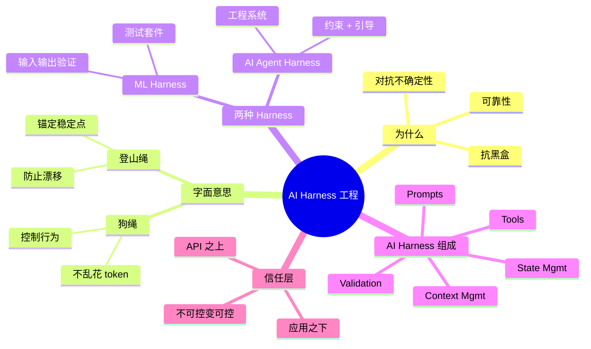

# IBM 团队：Harness 工程详解

## 一句话总结

IBM AI Developer Advocate Tages 在 18 分钟演讲中**从第一性原理拆解 AI Harness** — 为什么需要 harness（可靠性）、harness 的字面含义（登山绳/狗绳）、AI 工程中的 harness 是什么、以及如何对抗模型黑盒带来的不确定性。

## 核心洞察

### 1. 为什么需要 Harness：可靠性

> "We pay rent to companies that give us compute. Give us inference. Give us tokens in return. We literally $20 a month for Cloud Pro. And then you get a context window that's limited. And the model you rent is a black box."

**核心问题**：
- 你**租**模型的算力（如 $20/月 Claude Pro）
- context window **有限**
- 模型是**黑盒**（他们可能偷偷换模型）
- **变量太多无法控制**

> "The name of the game with harness is reliability. It's making sure that the agents we build do what they do, period. Irrespective of the black box, model irrespective of the thing we rent."

**Harness 的核心目标**：**可靠性**。不管底层模型怎么变，Agent 行为都一致。

### 2. Harness 的字面意思

> "If you've ever climbed a mountain or something or you've seen someone, this is a harness. It's like mountain climbers literally will harness themselves to what? To a mountain because it's stable. And they can't go off the rails literally."

**比喻**：
- **登山绳** — 把人系在稳定的山上，不能脱轨
- **狗绳** — 不让狗乱跑乱花 token

> "That's what a harness is by design. They anchor themselves in something stable so that they can't drift too far."

**本质**：harness = 锚定在稳定点，**防止漂移**

### 3. 两种 Harness 定义

> "There's really two types. There's one from the machine learning world, which is kind of like a test suite and a test runner. You give a model some inputs and you see the quality of the outputs."

| 类型 | 含义 | 应用 |
|------|------|------|
| **ML Harness** | 模型测试套件 | 给输入看输出质量 |
| **AI Agent Harness** | 围绕 LLM 的工程系统 | 让 Agent 行为可靠可重复 |

**本次重点**：AI Agent Harness

### 4. AI Harness 是什么

> "What is an agent harness?"

Tages 的核心论点：
- AI Harness 是**约束 + 引导**系统
- 让黑盒 LLM 在**可控环境**中工作
- 提供：
  - 工具集（Tools）
  - 提示（Prompts / System Messages）
  - 上下文管理
  - 状态管理
  - 输出验证

### 5. 信任层（Trust Layer）

> "They're going to talk today about the agent harness that is common in AI engineering."

Harness 在 AI 工程中的角色：
- **API 之上** — 调用模型
- **应用之下** — 提供稳定接口
- **信任中间层** — 让不可控的模型变可控

## 关键概念

| 概念 | 定义 |
|------|------|
| **Harness** | 围绕模型的工程系统，让 AI 行为可预测可靠 |
| **Reliability** | 不管模型黑盒怎么变，Agent 行为一致 |
| **Token Billionaire** | 自有前沿模型的公司（Anthropic / Google） |
| **Token Rent** | 付费用他人模型（$20/月 Claude Pro） |
| **Black Box Model** | 你不能控制模型具体行为 |
| **ML Harness** | ML 世界的测试套件 |
| **AI Agent Harness** | AI 工程中的约束 + 引导系统 |
| **Mountain Harness** | 登山绳比喻 — 锚定在稳定点 |
| **Trust Layer** | 信任中间层，让不可控变可控 |

## Harness 架构

```
┌────────────────────┐
│      应用层         │
└──────────┬─────────┘
           │
┌──────────▼─────────┐
│     Harness        │ ← 信任层 / 约束系统
│  ┌──────────────┐  │
│  │  Tools        │  │
│  │  Prompts     │  │
│  │  Context Mgmt│  │
│  │  Validation  │  │
│  │  State Mgmt  │  │
│  └──────────────┘  │
└──────────┬─────────┘
           │
┌──────────▼─────────┐
│   LLM API         │ ← 黑盒模型
│   (Claude / GPT)  │
└────────────────────┘
```

## 思维导图



## 原文金句（英中对照）

> **"We pay rent to companies that give us compute. Give us inference. Give us tokens in return. Some of you maybe work for companies that have frontier models like Anthropic or Google or whatever. And you maybe, what was the term? Token billionaires, yeah? I'm not that. I am maybe with Watson models. But the vast majority of us aren't token billionaires. We pay rent."**
> 译：*我们付租金给那些提供算力的公司——给我们 inference、给我们 token 作为回报。你们中的一些人可能在 Anthropic、Google 等拥有前沿模型的公司工作，叫什么来着？Token 亿万富翁？我不是。我可能就用用 Watson 模型。但我们绝大多数人都不是 Token 亿万富翁。我们都在付租金。*

> **"The name of the game with harness is reliability. It's making sure that the agents we build do what they do, period. Irrespective of the black box, model irrespective of the thing we rent and so on."**
> 译：*Harness 这件事的核心是可靠性。确保我们搭建的 Agent 做好该做的事，就这么简单。不管黑盒如何，不管我们租的是什么模型。*

> **"They anchor themselves in something stable so that they can't drift too far. Okay, that's what a harness is by design."**
> 译：*他们把自己系在某个稳定的东西上，这样就不会漂得太远。这就是 Harness 设计的本意。*

> **"Because your dog doesn't go and bankrupt you with tokens."**
> 译：*因为你的狗不会跑出去花光你所有 token。*（harness 防止乱花 token 的幽默说法）

> **"If we think about what harness, there's really two types. There's one from the machine learning world, which as I mentioned, is kind of like a test suite and a test runner. We're going to talk today about the agent harness that is common in AI engineering."**
> 译：*说到 Harness，其实有两种。一种是 ML 世界里的测试套件和测试运行器。今天我们要谈的是 AI 工程中常见的 agent harness。*

## 行动启示

1. **Harness = 可靠性** — 对抗模型黑盒的不确定性
2. **三种比喻记住** — 登山绳、狗绳、信任层
3. **不是 Token Billionaire 怎么办** — Harness 是普通人的解法
4. **Harness 5 大组件** — Tools / Prompts / Context / Validation / State
5. **Harness 是中间层** — 在 API 之上、应用之下
6. **防止漂移** — 锚定在稳定点
7. **从可靠性视角设计 Agent** — 而非单纯追求能力

## 关联笔记

- [[MOC - Agent Theory and Design]] — AI Agent 总索引
- [[MOC - Agent Theory and Design]] — B站视频知识库索引
- [[Cursor副总裁-构建软件开发过程的Agent]] — Cursor 团队视角
- [[OpenAI官方-Codex新手教程]] — Codex 内部视角
- [[Claude Code负责人-AI原生团队如何使用AI？]] — Claude Code 团队视角
- [[Manus创始人-深度干货-上下文工程的最佳实践]] — 上下文工程
- [[AI Agent Development]] — AI Agent 开发系统知识
- [[2026 年 Agent 最重要的工程概念 Harness Engineering]] — Harness 工程详解（官方 OpenAI 视角）

## 来源

- **原始视频**：[BV1eWGH6JE6m - IBM团队：Harness工程详解](https://www.bilibili.com/video/BV1eWGH6JE6m/)
- **UP主**：[Easonlee的AI笔记](https://space.bilibili.com/3546559488723681/upload/video)
- **原始会议演讲**：某 AI 工程师会议（推测是 AI Engineer Summit 或类似）
- **生成工具**：Recastory（手动 ingest + faster-whisper 转录 + LLM distill）
- **生成日期**：2026-06-10
- **转录模型**：faster-whisper base（en）
- **规范**：英文原文附中文翻译（[[kb-english-chinese-translation|记忆规则]]）
