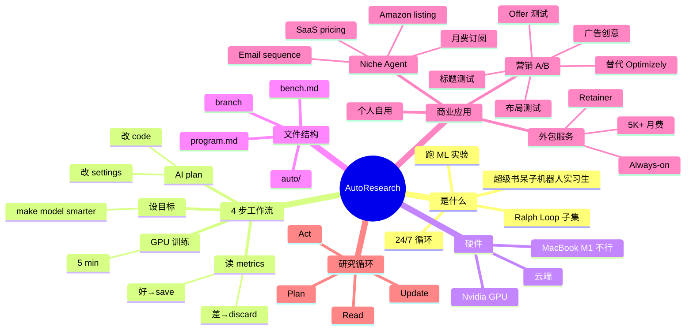

# Karpathy 爆火项目：AutoResearch 解读与启发

## 一句话总结

深度解读 **Karpathy 的 AutoResearch** — 像雇了一个"超级书呆子机器人实习生"，全天候在 GPU 上跑 ML 实验、自动 plan → act → 读 metrics → 更新 plan 循环，保留 winner 并衍生 **6 大商业应用**（niche agent 工具、A/B 测试优化器、内部研究 bot 等）。

## 核心洞察

### 1. AutoResearch 是什么

> "It's like having a super nerd robot intern that runs science experiments on AI models for you all night without you doing the boring stuff."

**本质**：
- 给 AI 一个**目标**（如"让小模型更聪明"）
- AI 自动 plan 实验 → 改 Python code → 跑 5 min 训练 → 读结果 → 决定下一步
- **24/7 循环** — 你醒来拿到最佳版本

### 2. 与 Ralph Loop 的关系

> "If you've seen my video on the Ralph loop where it basically would do engineering 24 seven and you'd wake up to new stuff happening in simplest terms that's what auto research is helping you."

- **Ralph Loop**：通用 24/7 工程循环
- **AutoResearch**：Ralph Loop 在 **ML 实验场景**的具体化

### 3. 4 步工作流

```
设定目标 (make this model smarter)
        ↓
AI plan 实验 (改 settings / 改 code)
        ↓
GPU 跑 5 min 训练
        ↓
读 metrics（变好就 save，变差就 discard）
        ↓
循环（直到你叫停）
```

**硬件要求**：
> "You need a Nvidia chip to actually run auto research or you can do in the cloud. You can't just run it on let's say you have a MacBook M1."

⚠️ 需要 **Nvidia GPU**（或云端），MacBook M1 不行

### 4. Shopify CEO Toby 的洞察

> "Auto research works even better for optimizing any piece of software. Make an auto folder, a program.md, and a bench.md. Make a branch and let it rip."

- 文件结构：`auto/` + `program.md` + `bench.md`
- 创建一个 branch 让它跑
- **对软件优化也有效**，不只是 ML

### 5. 6 大商业应用

#### 应用 1：Niche Agent in a Box（垂直小工具）

- 选一个你懂的小痛点
- 包装一个 tiny AutoResearch loop
- **盈利模式**：月费订阅
- 例子：
  - Amazon listing 实验器
  - Email sequence tuner
  - SaaS pricing optimizer

> "Pick the painful niche. Design the tiny auto research loop. Run experiments automatically. See which setup works best. Turn best setup to a simple agent product. Charge monthly subscription."

#### 应用 2：A/B Testing for Marketing（营销实验）

- 类似 Optimizely（早期火过的 A/B 测试 SaaS）
- Agent **自动试标题/布局/offer**
- 推到流量 → 测转化率 → 保留 winner
- 也可以做**广告创意**自动测试（Auto-test creatives, angles, audiences）

#### 应用 3：Auto Research for Personal Products（自用）

> "If you want to build your own products and just use this internally that works."

个人项目自用

#### 应用 4：Always-on Experiment Engine（外包给客户）

- 卖给其他公司当 retainer service
- 月费 $5K+？

### 6. 4 阶段研究循环

```
Step 1: 写清晰任务
  - "improve this model test score"
  - "figure out top 5 competitors for product xyz"
  
Step 2: 给予 bot 访问权限
  - 代码
  - GPU（ML 实验）
  - 互联网 + 文档（阅读任务）

Step 3: Bot 跑循环
  - plans
  - acts (运行 code / 搜索)
  - reads results
  - updates plan

Step 4: 回来 review
  - 6/12/20 小时后
  - 看 metrics + 文字总结
```

## 关键概念

| 概念 | 定义 |
|------|------|
| **AutoResearch** | Karpathy 开源的 ML 自动实验循环工具 |
| **Ralph Loop** | 通用 24/7 工程循环，AutoResearch 是其 ML 子集 |
| **program.md** | 描述目标的 Markdown 文件（让 AI 知道任务） |
| **bench.md** | 评估指标的 Markdown 文件（让 AI 知道什么算好） |
| **Niche Agent in a Box** | 包装小痛点的 AutoResearch 产品 |
| **A/B Testing for Marketing** | 自动化的转化率优化器 |
| **Always-on Experiment Engine** | 卖给客户的外包研究服务 |
| **Plan → Act → Read → Update** | 4 步研究循环 |

## 思维导图



## 原文金句（英中对照）

> **"Auto research is like having a super nerd robot intern that runs science experiments on AI models for you all night without you doing the boring stuff."**
> 译：*AutoResearch 就像雇了一个超级书呆子机器人实习生，全天候替你跑 AI 模型的科学实验，你不用做那些无聊的活。*

> **"If you've seen my video on the Ralph loop where it basically would do engineering 24 seven and you'd wake up to new stuff happening in simplest terms that's what auto research is helping you."**
> 译：*如果你看过我关于 Ralph Loop 的视频——基本上就是 24x7 做工程，醒来发现新进展——简单说这就是 AutoResearch 在帮你做的事。*

> **"You give it a goal. The AI agent does a thing. You tell the AI what better means — cheaper leads, more clicks, higher sales, better model score. And then the AI keeps changing things, testing them, and it only saves the changes that improve."**
> 译：*你给它一个目标。AI Agent 做这件事。你告诉 AI "更好"意味着什么——更便宜的线索、更多点击、更高销售额、更好的模型分数。然后 AI 不断修改、测试，只保留改进的变更。*

> **"Auto research works even better for optimizing any piece of software. Make an auto folder, a program.md, that's just a markdown file which is really the foundation of what a how you're going to be using auto research and a bench.md, make a branch and let it rip."**
> 译：*AutoResearch 对优化任何软件也都很好用。建一个 auto 文件夹、一个 program.md（只是一个 Markdown 文件，这就是你用 AutoResearch 的基础）和一个 bench.md，开个分支让它跑起来。*

> **"Pick the painful niche. Design the tiny auto research loop. Run experiments automatically. See which setup works best. Turn best setup to a simple agent product. Then you charge that monthly subscription."**
> 译：*选一个痛点。设计一个小型 AutoResearch 循环。自动跑实验。看看哪个方案最好。把最好的方案变成一个简单的 Agent 产品。然后你就能收月费了。*

> **"This is like conversion rate optimization around landing pages. You know the old think of tools like Optimizely? That's a SaaS tool that when I first moved to San Francisco you remember how big they were. And everyone was talking about Optimizely and A/B testing. And it's like, well, this is the future of that — auto research for different landing pages."**
> 译：*这就是围绕 landing page 的转化率优化。还记得 Optimizely 这种工具吗？当年我刚搬到旧金山时它们可红了，大家都在谈 Optimizely 和 A/B 测试。嗯，AutoResearch 就是它的未来——为不同 landing page 跑自动研究。*

## 行动启示

1. **从 Micro 痛点开始** — 选一个你懂的小问题，包装成 AutoResearch 产品
2. **月费订阅模式** — "这个工具 24/7 帮你跑实验，你点 accept 就行"
3. **目标 = 程序文件** — 用 `program.md` 描述目标，`bench.md` 描述评估
4. **Branch + let it rip** — 创建分支让 AI 跑，不打扰主线
5. **需要 Nvidia GPU** — 提前准备好云 GPU 资源
6. **不只 ML** — AutoResearch 对软件优化、营销、定价都有效
7. **学 AutoResearch** — 即使不创业，学会这个工具能"outperform 99.9% of people"

## 关联笔记

- [[MOC - Agent Theory and Design]] — AI Agent 总索引
- [[MOC - Agent Theory and Design]] — B站视频知识库索引
- [[Cursor副总裁-构建软件开发过程的Agent]] — Cursor 24/7 Agent 团队
- [[Claude Code负责人-AI原生团队如何使用AI？]] — Claude Code 内部 Agent 循环
- [[OpenAI官方-Codex新手教程]] — Codex CLI 入门
- [[AI Agent Development]] — AI Agent 开发系统知识
- [[AutoResearch]] — AutoResearch 项目（待创建）

## 来源

- **原始视频**：[BV1NpAHzZEcc - Karpathy爆火项目：Autoresearch解读与启发](https://www.bilibili.com/video/BV1NpAHzZEcc/)
- **UP主**：[Easonlee的AI笔记](https://space.bilibili.com/3546559488723681/upload/video)
- **生成工具**：Recastory（手动 ingest + faster-whisper 转录 + LLM distill）
- **生成日期**：2026-06-10
- **转录模型**：faster-whisper base（en）
- **规范**：英文原文附中文翻译（[[kb-english-chinese-translation|记忆规则]]）
