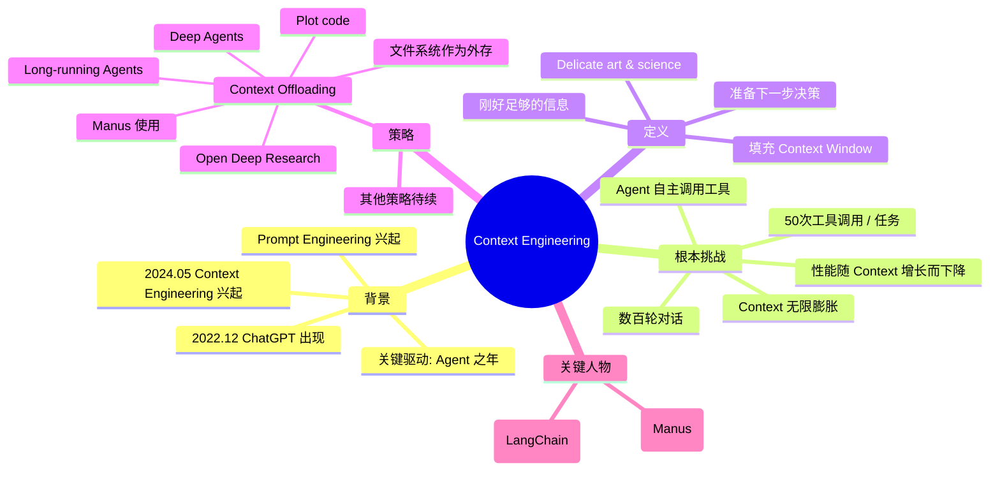

# Manus 创始人：上下文工程的最佳实践

## 一句话总结

LangChain 创始人 Lance 主持，与 Manus 联合创始人兼首席科学家 Peek 深入探讨**上下文工程（Context Engineering）** — 这是继 Prompt Engineering 之后的下一波浪潮，核心解决 Agent 在长时运行中上下文爆炸导致性能下降的根本挑战。

## 核心洞察

### 1. 为什么 Context Engineering 突然崛起？

- **时间线**：Prompt Engineering 在 ChatGPT 出现（2022.12）后兴起；Context Engineering 在 2024 年 5 月左右开始爆发（Google Trends 显示），恰好与"Agent 之年"重合。
- **根本原因**：Agent 自主调用工具导致**上下文无限膨胀**，而我们已知**性能随上下文增长而下降**。
- **关键数据点**：
  - Manus：典型任务约 50 次工具调用
  - Anthropic：生产 Agent 可达数百轮对话
  - 每次工具调用 = 一次工具观察（tool observation）追加到消息列表

### 2. 上下文工程的定义

> "You can think about context engineering as the delicate art and science of filling the context window with just the right information needed for the next step."

**关键含义**：
- 不是把所有信息塞进 context window
- 而是精确选择下一步决策所需的最少信息
- 像"用吸管喝水" — 只取所需，不要全部灌入

### 3. 解决上下文爆炸的四大策略

#### 策略一：Context Offloading（上下文外存）

**核心思想**：把不需要一直驻留在 context window 的信息挪到外部，需要时可检索。

**典型实现**：文件系统作为外部记忆
- Manus 使用
- LangChain 的 Deep Agents 项目
- Open Deep Research
- Plot code（编程 Agent）

> "You can take information and offload it, send it somewhere else. So it's outside the context window, but it can be retrieved."

#### 策略二：（其他策略由 Peek 后续展开）

视频中 Peek 后续会分享更多新想法（基于 Manus 几个月前发布的博客文章）。

## 关键概念

| 概念 | 定义 |
|------|------|
| **Context Engineering**（上下文工程） | 在每个步骤为 Agent 准备"刚好够用"的信息，区别于把所有内容都放进 prompt |
| **Prompt Engineering**（提示工程） | 上一波浪潮，关注如何措辞单个 prompt |
| **Tool Observation**（工具观察） | Agent 调用工具后，工具返回的结果消息（每次调用都追加到消息历史） |
| **Context Offloading**（上下文外存） | 把大段内容（如 web 搜索结果、文件内容）存储到外部，context 中只保留指针 |
| **Long-running Agent**（长时运行 Agent） | 跨多轮对话、调用大量工具的 Agent，上下文积累是核心挑战 |
| **Deep Agents** | LangChain 的一个项目，使用文件系统作为 Agent 的外部记忆 |
| **Open Deep Research** | LangChain 的开源深度研究项目，agent state 起到类似外部文件系统的作用 |

## 实战参考

### Manus 的实践

- 产品定位：通用 Agent 框架
- Peek 角色：设计 Agent Framework 的核心架构
- 几个月前发布过 Context Engineering 的博客文章，引发行业关注
- 典型任务量：~50 次工具调用/任务

### LangChain 生态

- Deep Agents：文件系统作为 context 的范式实现
- Open Deep Research：agent state 模拟外部文件系统
- 都在用 context offloading 的思路

## 思维导图

## 原文金句（英中对照）

> **"We have an LLM bound to some number of tools that LLM can call tools autonomously in a loop. The challenge is for every tool called, you get a tool observation back, and that's appended to this chat list. These messages grow over time."**
> 译：*我们有一个 LLM 绑定了若干工具，LLM 可以在循环中自主调用这些工具。挑战在于每调用一次工具，就会得到一个工具观察结果，并被追加到对话列表中。这些消息会随时间不断增长。*

> **"You can think about context engineering as the delicate art and science of filling the context window with just the right information needed for the next step."**
> 译：*你可以把上下文工程理解为：精心填充上下文窗口的艺术与科学 — 只放入下一步所需的最准确信息。*

> **"So there's a few common themes I want to highlight that we've seen across a number of different pieces of work, including Manus."**
> 译：*我想强调一些我们观察到的、在不同工作中（包括 Manus）反复出现的共同主题。*

> **"The central idea is, you don't need all context to live in this message's history of your agent. You can take information and offload it, send it somewhere else."**
> 译：*核心思想是：你不需要把所有 context 都留在 Agent 的消息历史里。你可以把信息挪出来，存到别的地方去。*

> **"Web search result that's very token heavy, isn't spanned into your context window for perpetuity."**
> 译：*像 web 搜索结果这种 token 量极大的内容，不会永远占据你的上下文窗口。*

> **"Performance drops as context grows."**
> 译：*性能随上下文增长而下降。*

> **"The paradox through this challenge in situation, agents utilize lots of context because of tool calling. But we know that performance drops as context grows."**
> 译：*这一矛盾在于：Agent 因为工具调用需要大量上下文；但我们知道性能会随上下文增长而下降。*

## 行动启示

1. **重新审视 Prompt Engineering** — 单一 prompt 已不够，Context Engineering 才是 Agent 时代的关键技能
2. **把外部存储当一等公民** — 文件系统、向量数据库、外部 state 都是 Agent 的"长期记忆"
3. **避免"Context 通胀"** — 不要把所有信息都堆进 context window，要按需检索
4. **工具调用是 Context 的双刃剑** — 每次工具调用带来信息，但也是 Context 增长的主因
5. **学习 Deep Agents 范式** — LangChain 的 Deep Agents 是文件作为外存的典型实现

## 关联笔记

- [[MOC - Agent Theory and Design]] — AI Agent 总索引
- [[MOC - Agent Theory and Design]] — B站视频知识库索引
- [[Cursor副总裁-构建软件开发过程的Agent]] — Cursor 副总裁的 Agent 团队实践
- [[AI Agent Development]] — AI Agent 开发系统知识
- [[Workflow and Skill Management]] — Skill 与工作流管理
- [[OpenDeepResearch]] — Open Deep Research 项目（待创建）
- [[Deep Agents]] — LangChain Deep Agents（待创建）

## 来源

- **原始视频**：[BV12x1xB8E7b - Manus创始人：深度干货！上下文工程的最佳实践](https://www.bilibili.com/video/BV12x1xB8E7b/)
- **UP主**：[Easonlee的AI笔记](https://space.bilibili.com/3546559488723681/upload/video)
- **原始直播**：LangChain 主持的 Manus 创始人访谈
- **生成工具**：Recastory（手动 ingest + faster-whisper 转录 + LLM distill）
- **生成日期**：2026-06-09
- **转录模型**：faster-whisper base（en）
- **规范**：英文原文附中文翻译（[[kb-english-chinese-translation|记忆规则]]）
