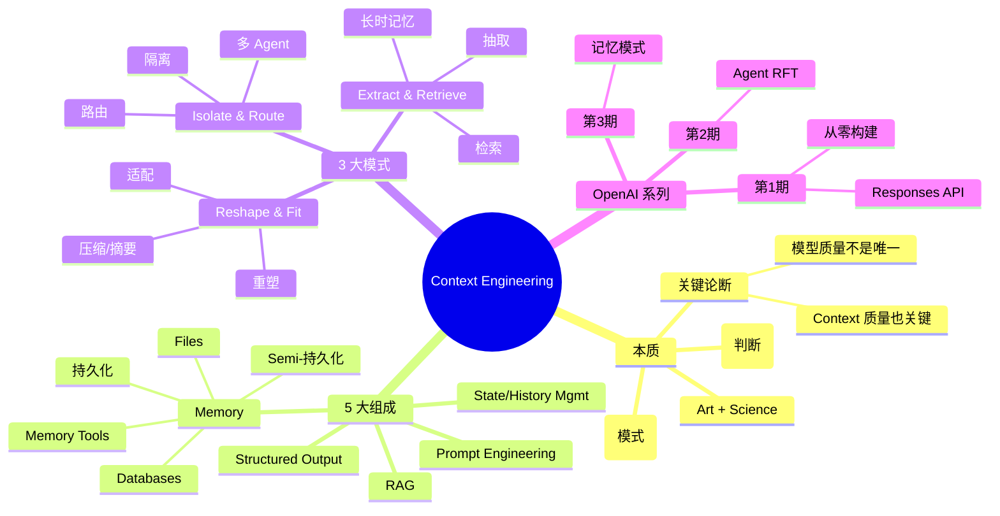

# OpenAI 员工：上下文工程和 Agent 记忆

## 一句话总结

OpenAI 解决方案架构师 Emory + Brian 在 Build Hour 系列中**系统讲解上下文工程和 Agent 记忆模式** — 从 context engineering 定义入手，覆盖 3 大核心记忆模式（Reshape & Fit、Isolate & Route、Extract & Retrieve），强调现代 LLM 性能**不只取决于模型质量，更取决于你给它的 context**。

## 核心洞察

### 1. Context Engineering 的本质

> "Context engineering is both an art and a science. So it's art because it involves judgment. So you have to decide what matters most at a given step of a reasoning or action processes. It's science because there are concrete patterns, methods, and miserable impacts to make context management more systematic and repeatable."

**双重属性**：
- **Art（艺术）**— 需要判断：每步推理/行动什么最重要
- **Science（科学）**— 有具体模式：让 context 管理**系统化、可重复**

> "Modern LLMs don't just perform based on the model quality, but they perform based on the context you give them."

**关键洞察**：模型质量不是唯一决定因素，**context 质量** 同样关键。

### 2. Context Engineering 生态体系

**5 大组成层**：
1. **Prompt Engineering** — 核心原则
2. **Structured Output** — 结构化输出
3. **RAG**（Retrieval-Augmented Generation）— 检索增强
4. **State and History Management** — 状态与历史管理
5. **Memory** — 持久化记忆（files、databases、memory tools）

Context Engineering = 上述所有 + 跨层协同

### 3. 3 大 Agent 记忆模式

#### 模式 1：Reshape & Fit（重塑与适配）

> 把 context 重新组织成最合适的形式，让 LLM 能"消化"

#### 模式 2：Isolate & Route（隔离与路由）

> 把不同的 context **隔离**到不同通道，**路由**给相关的 agent/任务

#### 模式 3：Extract & Retrieve（抽取与检索）

> 长期信息**抽取**出来存储，需要时**检索**回来

### 4. 上下文窗口的现实

> "Why it matters because long-running tools..."（长运行工具 → 上下文膨胀）

**痛点**：
- Agent 长时运行 = 上下文持续增长
- 工具调用 = 每次都增加 context
- 模型有效 context 实际有限
- 必须**主动管理**

### 5. OpenAI 之前 Build Hour 系列

> "When we started with how to build agents from scratch, using responses API, then moved into agent RFT, and today exploring agent memory patterns."

**系列脉络**：
1. 第 1 期：如何用 Responses API 从零构建 Agent
2. 第 2 期：Agent RFT（Reinforcement Fine-Tuning）
3. 第 3 期：Agent 记忆模式（本期）

## 关键概念

| 概念 | 定义 |
|------|------|
| **Context Engineering** | 选择、构建、维护 LLM 上下文的过程（art + science） |
| **Reshape & Fit** | 重塑 context 让 LLM 更好消化 |
| **Isolate & Route** | 隔离不同 context，按需路由 |
| **Extract & Retrieve** | 长时信息抽取 + 检索 |
| **Persistent Storage** | 持久化存储（files / databases / memory tools） |
| **Long-running Tools** | 长时运行工具，导致 context 膨胀 |
| **RFT**（Reinforcement Fine-Tuning） | 强化学习微调 |
| **Responses API** | OpenAI 的 Agent 基础 API |
| **Memory Tools** | OpenAI 提供的持久化记忆工具 |
| **State Management** | 状态管理（context 中保存执行状态） |

## 实战应用

### 3 大模式应用场景

| 模式 | 适用场景 | 示例 |
|------|---------|------|
| **Reshape & Fit** | context 太多/太少/格式不对 | 压缩长对话、重新组织 JSON、摘要替换原文 |
| **Isolate & Route** | 多 agent 协作 | 销售 Agent vs 技术 Agent 各自隔离 context |
| **Extract & Retrieve** | 长时记忆 | 用户偏好、过往决策、项目背景 |

### Context Engineering 决策树

```
Agent 运行遇到问题
    ↓
context 太长？
    → 是 → Reshape & Fit（压缩/摘要/重新组织）
    → 否 → context 不对？
        → 是 → Extract & Retrieve（补充正确信息）
        → 否 → 多 agent 协作？
            → 是 → Isolate & Route（隔离 + 路由）
            → 否 → 重新审视 Prompt Engineering
```

## 思维导图



## 原文金句（英中对照）

> **"Context engineering is both an art and a science. So it's art because it involves judgment. So you have to decide what matters most at a given step of a reasoning or action processes. It's science because there are concrete patterns, methods, and miserable impacts to make context management more systematic and repeatable."**
> 译：*上下文工程既是艺术也是科学。作为艺术，它需要判断——你得决定在某个推理/行动步骤中什么最重要。作为科学，它有具体的模式和方法，让 context 管理更系统、可重复。*

> **"Modern LLMs don't just perform based on the model quality, but they perform based on the context you give them."**
> 译：*现代 LLM 的表现不只取决于模型质量，更取决于你给它的 context。*

> **"Context engineering is a broader discipline than any single technique like prompt engineering or retrieval."**
> 译：*上下文工程是比任何单一技术（如 prompt engineering 或 retrieval）更宽泛的学科。*

> **"Using persistent or semi-persistent storage like files, databases, or memory tools to upload and retrieve key information."**
> 译：*用持久化或半持久化存储（如文件、数据库、memory 工具）来上传和检索关键信息。*

> **"Why it matters because long-running tools..."**
> 译：*这很重要，因为长时运行的工具……*（导致 context 膨胀）

## 行动启示

1. **Context Engineering 比 Prompt Engineering 范围更广** — 是更高级的 discipline
2. **模型质量 + Context 质量** = 真正性能
3. **3 大模式记牢** — Reshape & Fit / Isolate & Route / Extract & Retrieve
4. **长时运行 Agent 必须做 context 管理** — 不然必崩
5. **Memory 工具** — 用 OpenAI 提供的 files/databases/memory tools
6. **多 Agent 协作** — 用 Isolate & Route 隔离 context
7. **Build Hour 系列** — 是 OpenAI Agent 知识系统，建议看完

## 关联笔记

- [[MOC - Agent Theory and Design]] — AI Agent 总索引
- [[MOC - Agent Theory and Design]] — B站视频知识库索引
- [[Manus创始人-深度干货-上下文工程的最佳实践]] — 上下文工程实战
- [[Cursor副总裁-构建软件开发过程的Agent]] — Cursor Agent 团队
- [[OpenAI官方-Codex新手教程]] — Codex CLI 入门
- [[AI Agent Development]] — AI Agent 开发系统知识
- [[Context Engineering]] — 上下文工程详解（待创建）
- [[Agent Memory Patterns]] — 3 大记忆模式（待创建）

## 来源

- **原始视频**：[BV14nrMBKENb - OpenAI员工：上下文工程和Agent记忆](https://www.bilibili.com/video/BV14nrMBKENb/)
- **UP主**：[Easonlee的AI笔记](https://space.bilibili.com/3546559488723681/upload/video)
- **原始直播**：OpenAI Build Hour 系列第 3 期
- **生成工具**：Recastory（手动 ingest + faster-whisper 转录 + LLM distill）
- **生成日期**：2026-06-10
- **转录模型**：faster-whisper base（en）
- **规范**：英文原文附中文翻译（[[kb-english-chinese-translation|记忆规则]]）
