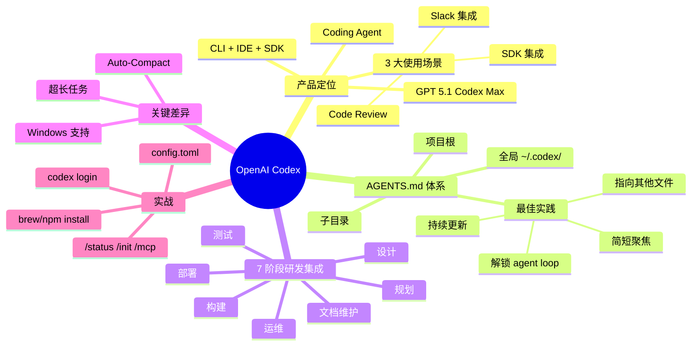

# OpenAI 官方：Codex 新手教程

## 一句话总结

OpenAI 官方 onboarding 工程师（Derek、Sterling、Charlie）系统讲解 **Codex CLI/IDE 完整入门** — 涵盖安装、AGENTS.md 配置、prompt 最佳实践、CLI/IDE 技巧、MCP 配置、SDK 集成，以及如何把 Codex 嵌入团队的 7 阶段软件研发流程。

## 核心洞察

### 1. Codex 是什么

- **定位**：OpenAI 的 **coding agent**（不只是 coding assistant）
- **多 surface**：CLI、IDE 扩展、Headless SDK
- **最新模型**：**GPT 5.1 Codex Max**（专为 agented coding 训练）
- **训练环境**：原生支持 Linux / Mac OS / Windows，遵守沙箱规则

### 2. Codex 三大使用场景

| 场景 | 说明 |
|------|------|
| **Code Review** | PR 打开时 Codex Cloud 自动 review、评论、找 critical bugs |
| **Slack 集成** | Slack 中 `@Codex`，它读取整段对话线程，生成 PR |
| **SDK 集成** | 程序化运行 Codex，可获取结构化输出，集成到自定义容器 |

### 3. AGENTS.md：让 Agent 永远懂你

> "Coding agents don't really retain any context between sessions. Every time you start it up, it's coming in with a fresh context window. The agents.md ensures that the instructions that you want to give the agent are always loaded automatically."

**核心思想**：每次启动 Codex 都是新 context，AGENTS.md 是 Agent 必读的"项目 README"。

**三层 AGENTS.md 体系**：

| 层级 | 位置 | 用途 |
|------|------|------|
| **全局** | `~/.codex/AGENTS.md` | 全局配置（工具偏好、行为习惯） |
| **项目根** | `<project>/AGENTS.md` | 项目概览、构建命令、整体工作流 |
| **子目录** | `<project>/subdir/AGENTS.md` | 子服务/子模块的特定上下文 |

**AGENTS.md 编写 4 大最佳实践**：

1. **简短聚焦** — OpenAI 内部 AGENTS.md 平均**不到 100 行**，太多指令会让 Agent 困惑甚至解决冲突
2. **解锁 agent loop** — 加入 lint、test、screenshot 等校验命令，让 Agent 自己验证
3. **持续更新** — 看到 Codex 推导命令慢、犯错时，把解决方案写进 AGENTS.md
4. **指向其他文件** — 主 AGENTS.md 保持通用，引用 `exec_plans.md`、`frontend.md`、`architecture.md` 等

### 4. Codex 的 7 阶段软件研发集成

> "We broke it down into seven phases that span planning and design all the way to documentation and maintenance."

OpenAI 内部把 AI Native 团队的工程工作分为 7 阶段，Codex 都能在每个阶段提供加速：

**规划阶段**：需求分析、架构方案、任务分解
**设计阶段**：API 设计、数据模型、UX
**构建阶段**：编码、单元测试、code review
**测试阶段**：集成测试、E2E、bug 复现
**部署阶段**：CI/CD、发布管理
**运维阶段**：监控、oncall、incident response
**文档/维护**：文档生成、refactor、技术债清理

### 5. Codex 与 Claude Code 的关键差异

> "We trained the model to be able to accurately auto-compact long conversations so you can have Codex work for you on longer running tasks."

- **Windows 支持** — 重要差异化
- **超长任务** — GPT-5.1 Codex Max 训练为能 auto-compact 长对话，支持大规模 refactor

## 关键概念

| 概念 | 定义 |
|------|------|
| **Codex** | OpenAI 的 coding agent 产品，CLI + IDE + SDK 三 surface |
| **GPT 5.1 Codex Max** | OpenAI 最新的 coding 专用模型，专为 agented coding 训练 |
| **AGENTS.md** | Agent 必读的项目说明文件，类似 README 但针对 agent 优化 |
| **Codex Cloud** | 远程 task 执行环境，可关闭笔记本后台跑 async 任务（code review） |
| **Headless SDK** | 编程式调用 Codex，获取结构化输出，集成到自定义容器 |
| **Sandboxing** | 模型在 Bash/PowerShell 中执行的沙箱安全机制 |
| **Auto-Compact** | GPT-5.1 Codex Max 自动压缩长对话的能力，支持超长任务 |
| **Exec Plan** | 用 `exec_plans.md` 模板生成的多步骤计划，可作为 living document 持续更新 |
| **MCP**（Model Context Protocol） | 用于给 Codex 集成外部工具的协议 |
| **ChatGPT Enterprise / Team** | Codex 的企业版本，SSO 集成 |

## 安装与配置速查

```bash
# 安装 Codex CLI（推荐方式）
brew install codex  # 或 npm install -g @openai/codex

# 登录（打开浏览器用 ChatGPT Enterprise 账户）
codex login

# 检查状态
/status  # 看模型、目录、沙箱、approval policy、剩余 context

# 克隆并启动
git clone https://github.com/agentsmd/agents.md
cd agents.md
npm install && npm run dev
codex
```

### CLI 关键命令

| 命令 | 作用 |
|------|------|
| `codex` | 启动交互式会话 |
| `codex login` | 登录 ChatGPT 账户 |
| `/status` | 查看当前配置状态 |
| `/init` | 自动生成 AGENTS.md |
| `/mcp` | 配置 MCP 服务器 |

## 实战最佳实践

### 配置 `config.toml`

```toml
# 自动批准某些安全命令
approval_policy = "auto-edit"

# 沙箱模式
sandbox_mode = "workspace-write"

# 网络访问
network_access = "enabled"
```

### Prompting 最佳实践

1. **具体明确** — 不要 "优化这个函数"，要 "把 O(n²) 改成 O(n log n)，保持原签名"
2. **给出 context** — "在 `services/auth/` 中，这是 OAuth callback handler"
3. **列出验证步骤** — "完成后跑 `npm test` 并截图"
4. **分步引导** — 复杂任务用 AGENTS.md 引用 exec_plans.md

### IDE 扩展

- 在 VS Code 扩展市场搜索 "OpenAI Codex"（注意是**官方**那个）
- 支持 auto-update
- 安装后用同一个 ChatGPT 账户登录

## 思维导图



## 原文金句（英中对照）

> **"Codex is open AI's coding agent that developers can use across different surfaces, and we've seen firsthand how developers are delegating routine and time-consuming tasks to Codex, and spending more time on complex and novel challenges, like design and architecture."**
> 译：*Codex 是 OpenAI 的 coding agent，开发者可在多种界面使用。我们亲眼看到开发者把日常、耗时的任务委托给 Codex，自己把更多时间投入到设计、架构等复杂且新颖的挑战中。*

> **"Codex is backed by our state of the art models, most recently, GPT 5.1 Codex Max, which is our best model for agented coding. So it's specifically trained in the Codex CLI harness."**
> 译：*Codex 由 OpenAI 最先进的模型支撑，最新的是 GPT-5.1 Codex Max —— 这是我们为 agented coding 打造的旗舰模型，专门在 Codex CLI 的 harness 上训练。*

> **"We also trained the model to be able to accurately auto-compact long conversations so you can have Codex work for you on longer running tasks."**
> 译：*我们还训练了模型自动精准压缩长对话的能力，让 Codex 能为你的超长时任务持续工作。*

> **"Coding agents don't really retain any context between sessions. Every time you start it up, it's coming in with a fresh context window. The agents.md ensures that the instructions that you want to give the agent are always loaded automatically."**
> 译：*Coding agent 在 session 之间不会保留任何 context。每次启动都是全新的 context window。AGENTS.md 正是确保你想给 agent 的指令每次都被自动加载。*

> **"If you include too many instructions that can confuse the coding agent and it won't know exactly what to pay attention to or if they're conflicting, it can spend a lot of time figuring out how to resolve the conflicts."**
> 译：*如果指令太多，会让 coding agent 困惑——它不知道该重点关注什么；如果互相矛盾，它会花大量时间尝试解决冲突。*

> **"We broke it down into seven phases that span planning and design all the way to documentation and maintenance."**
> 译：*我们把工作拆成了 7 个阶段，从规划、设计一路延伸到文档与维护。*

> **"Most of OpenAI's agents, MD files, and we looked in the monitoring, but I figured this out, were less than 100 lines."**
> 译：*OpenAI 大部分 AGENTS.md 文件——我们查过监控数据——都不到 100 行。*

## 行动启示

1. **从 AGENTS.md 开始** — 不写 AGENTS.md 就用 Coding Agent 就像不带地图就上路
2. **保持 AGENTS.md 简洁** — 100 行内最有效，过度反而有害
3. **用三层 AGENTS.md 体系** — 全局 / 项目根 / 子目录，各司其职
4. **解锁 agent loop** — 给 Agent 验证工具（lint、test、screenshot），让它自检
5. **持续迭代 AGENTS.md** — 看到 Agent 反复犯错或推导命令慢，立刻更新
6. **Codex 在 Windows 上有优势** — 如果团队是 Windows-first，Codex 比 Claude Code 体验更好
7. **Codex Cloud 用于异步任务** — code review、长时任务可放云端跑，关笔记本也行

## 关联笔记

- [[MOC - Agent Theory and Design]] — AI Agent 总索引
- [[MOC - Agent Theory and Design]] — B站视频知识库索引
- [[Cursor副总裁-构建软件开发过程的Agent]] — Cursor 副总裁的 STLC Agent 实践
- [[Manus创始人-深度干货-上下文工程的最佳实践]] — Context Engineering 范式
- [[AI Agent Development]] — AI Agent 开发系统知识
- [[Workflow and Skill Management]] — Skill 与工作流管理
- [[Codex]] — OpenAI Codex 项目（待创建）

## 来源

- **原始视频**：[BV19MzXBNESV - OpenAI官方：Codex新手教程](https://www.bilibili.com/video/BV19MzXBNESV/)
- **UP主**：[Easonlee的AI笔记](https://space.bilibili.com/3546559488723681/upload/video)
- **原始直播**：OpenAI 官方 Getting Started with Codex webinar
- **生成工具**：Recastory（手动 ingest + faster-whisper 转录 + LLM distill）
- **生成日期**：2026-06-09
- **转录模型**：faster-whisper base（en）
- **规范**：英文原文附中文翻译（[[kb-english-chinese-translation|记忆规则]]）
