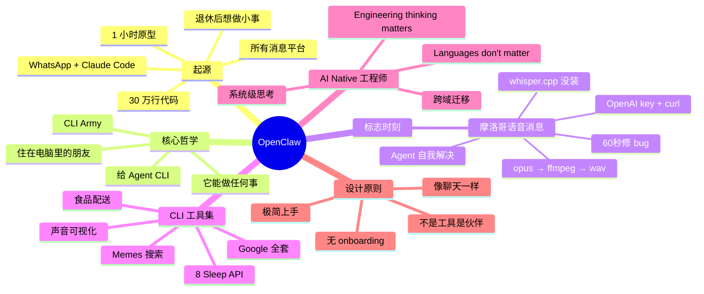

# OpenClaw 创始人：我是如何使用 OpenClaw 的？

## 一句话总结

OpenClaw 创始人 Peter Steinberger 分享他从零搭建 **个人 AI 助理** 的故事 — 把 Anthropic 的 Claude Code 接入 WhatsApp，**让它住在你的电脑里**，通过 CLI 工具"军队"控制 Google、Eight Sleep、智能家居等所有数字服务，并分享了一个惊人的"自我黑科技"时刻：Agent 自己用 ffmpeg + curl + OpenAI API 解决了语音消息问题。

## 核心洞察

### 1. 起源：把 WhatsApp 接到 Claude Code

- 退休后想做一件事：**从手机就能查电脑上的事**
- 当时（2024.11）大厂都没做"AI 跟着你走"这件事
- Peter 花了 **1 小时**做的原型：WhatsApp 消息 → Claude Code → 返回结果
- 上线后增长失控：现在已经 ~30 万行代码，支持几乎所有消息平台

### 2. "住在你电脑里的资源丰富的朋友"

> "It's just like having a new weird friend that is also really smart and resourceful that lives on your computer."

OpenClaw 的核心定位：**CLI Army** — Agent 通过调用 CLI 工具控制一切。

> "What are agents good with? Calling CLIs. Because that's what they train for."

Peter 自建的 CLI 列表：
- Google 全套（Places API 等）
- Memes / GIFs 搜索
- 声音可视化（让 AI"体验"音乐）
- 食品配送追踪
- **Eight Sleep API**（控制床的温度）
- 等等

### 3. 著名的"AI 自助解决语音问题"时刻

Peter 在摩洛哥过生日，发送了一条**语音消息**（但他没建 voice 支持）：
- Agent 自己找到 **opus 音频格式**（看文件头）
- 调用 **ffmpeg** 转 wav
- 找到 **whisper.cpp**（没装）
- 找到 **OpenAI API key**
- 用 **curl** 发到 OpenAI
- 拿到转录
- 回复

> "Wow, how the F did you do that? ... Those things are so resourceful, also in a scary way."

> "I think a lot of people don't realize that if you give an AI access to your computer, they can basically do anything that you can do."

### 4. "AI Native" 跨领域工程师的觉醒

Peter 自述：做了 20 年 Apple 生态（iOS/macOS）专家，从 Objective-C/Switch 转到 TypeScript 时：
- 概念都懂，但**语法不熟**（"where do I put the parens?"）
- 以前这很痛苦（要查每个细节）
- 现在**AI 抹平了所有这些**：你能用 system-level thinking、taste、架构判断跨域迁移

> "I feel like I could build anything. Languages don't matter anymore. My engineering thinking matters."

### 5. 摩洛哥实战案例：60 秒修 Bug

朋友发了条 bug 推文，Peter：
- 截屏推文
- WhatsApp 发给 OpenClaw
- Agent **读了推文** → **理解有 bug** → **克隆 git repo** → **修代码** → **commit** → **回复推特 "已修"**
- 整个过程无人监督

### 6. 80% 的 App 将被替代

> "This will lend away probably 80% of the apps that you have on your phone. Why should I use my fitness pal to track food? I have an infinitely resourceful assistant that already knows I'm making bad decisions."

## 关键概念

| 概念 | 定义 |
|------|------|
| **OpenClaw** | Peter 创办的个人 AI 助理，接入消息平台，通过 CLI 调用控制一切 |
| **Claude Code** | Anthropic 的 CLI coding agent，OpenClaw 的核心引擎 |
| **CLI Army** | OpenClaw 模式：给 Agent 一堆 CLI 工具，让它能做任何事 |
| **WhatsApp 集成** | 通过消息平台访问 AI，门槛低、无 onboarding |
| **MCP** | Model Context Protocol，给 Agent 加能力的协议 |
| **Taste / 系统级思考** | 比具体语言/语法更重要的工程师能力，AI 时代跨域迁移的关键 |
| **"住在你电脑里的朋友"** | OpenClaw 的设计哲学 — 不是工具，是伙伴 |
| **Voice message 自助解决** | Agent 用 ffmpeg + whisper + curl 解决未实现功能的标志性事件 |

## 实战参考

### 摩洛哥用例

1. **查方向/餐厅** — 走路时问 AI
2. **修 GitHub bug** — 截屏 → AI 自动 fix
3. **发语音** — AI 自动转录（自实现）

### 8 Sleep 控制

Peter 接入 Eight Sleep API，让 OpenClaw **调节床的温度**。这是"AI 控制物理设备"的早期案例。

### Memes 回复

CLI 工具支持查 memes/gifs，让 AI 跟朋友聊天时能"发表情包"。

## 思维导图

## 原文金句（英中对照）

> **"It's just like having a new weird friend that is also really smart and resourceful that lives on your computer."**
> 译：*它就像住在你电脑里的一个新奇的朋友，又非常聪明、又有资源。*

> **"What are agents good with? Calling CLIs. Because that's what they train for."**
> 译：*Agent 擅长什么？调用 CLI。因为它们就是被训练来干这个的。*

> **"This will lend away probably 80% of the apps that you have on your phone. Why should I use my fitness pal to track food? I have an infinitely resourceful assistant that already knows I'm making bad decisions and I'm eating Kentucky Fried Chicken."**
> 译：*这会淘汰你手机里大概 80% 的应用。我为什么要用 MyFitnessPal 记录饮食？我有一个资源无限丰富的助理，它已经知道我在做糟糕的决定、吃的是肯德基。*

> **"Those things are so resourceful, also in a scary way, it's like unscheduled ChatGBT."**
> 译：*这些东西太 resourceful 了，scary 地 resourceful，就像是无限制版的 ChatGPT。*

> **"I think a lot of people don't realize that those things like Cloud Code, they're not just good for programming, they are very resourceful for any kind of problem."**
> 译：*我觉得很多人没意识到，像 Claude Code 这类东西不只擅长编程，它们对任何问题都非常 resourceful。*

> **"I feel like I could build anything. Languages don't matter anymore. My engineering thinking matters."**
> 译：*我感觉自己能构建任何东西。语言不再重要了，我的工程思维才重要。*

> **"If you give an AI access to your computer, they can basically do anything that you can do on your computer."**
> 译：*只要你给 AI 电脑的访问权限，它基本上能做任何你能做的事。*

## 行动启示

1. **CLI 是 Agent 的"超能力"** — 给 Agent CLI 工具，让它能做你做的所有事
2. **接入消息平台是低门槛** — WhatsApp/iMessage/Slack 比独立 App 更易传播
3. **AI 是跨域工程师的"语法擦除器"** — 系统思维、品味、架构判断比 syntax 重要
4. **Agent 的"自助"时刻是真正的能力展示** — 不要预设所有功能，让 Agent 自己想办法
5. **把 CLI 当 Lego** — 每个 CLI 是一块乐高，组合起来就是 Agent 的"工具箱"
6. **警惕 AI 的"resourcefulness"** — Peter 自述"also in a scary way"，能力越强边界越模糊

## 关联笔记

- [[MOC - Agent Theory and Design]] — AI Agent 总索引
- [[MOC - Agent Theory and Design]] — B站视频知识库索引
- [[Cursor副总裁-构建软件开发过程的Agent]] — Cursor 的 STLC Agent 实践
- [[Manus创始人-深度干货-上下文工程的最佳实践]] — Context Engineering 范式
- [[OpenAI官方-Codex新手教程]] — Codex CLI 入门
- [[Claude Code负责人-AI原生团队如何使用AI]] — Claude Code 内部视角
- [[AI Agent Development]] — AI Agent 开发系统知识

## 来源

- **原始视频**：[BV1WnctziEac - OpenClaw 创始人：我是如何使用OpenClaw的？](https://www.bilibili.com/video/BV1WnctziEac/)
- **UP主**：[Easonlee的AI笔记](https://space.bilibili.com/3546559488723681/upload/video)
- **原始播客**：Peter Steinberger 在 Latent Space 播客访谈
- **生成工具**：Recastory（手动 ingest + faster-whisper 转录 + LLM distill）
- **生成日期**：2026-06-10
- **转录模型**：faster-whisper base（en）
- **规范**：英文原文附中文翻译（[[kb-english-chinese-translation|记忆规则]]）
