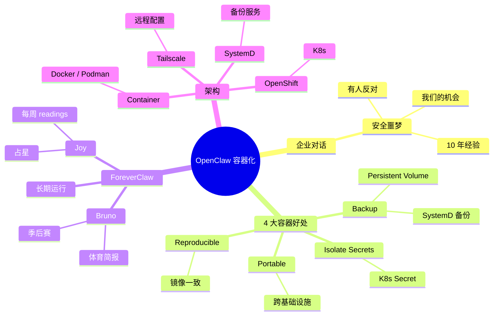

# OpenClaw 实战：从本地到 K8S 部署

## 一句话总结

一位有 10 年容器/Linux 安全经验的 **Red Hat 工程师**分享把 **OpenClaw 跑在容器/K8S/OpenShift 上**的实战经验 — 包含如何让企业（Red Hat）内部接受"安全噩梦"般的 AI Agent、容器化的 4 大好处（可重现、隔离、便携、备份），以及 ForeverClaw 的人格化设计。

## 核心洞察

### 1. 企业内"安全噩梦"vs"我们的机会"

> "I went back to work, I'm like, guys, check out OpenClaw, this is so cool. And a couple people on Slack are like, it's a security nightmare, do not use OpenClaw, don't put it on the work laptop."

> "I'm like, guys, what have I been doing the past 10 years? We can take any application and run it securely. That's what REL is. If we can't take an application and run it securely, come on. This is our golden opportunity to show everyone."

**Red Hat 内部对话**：
- 一些人说："OpenClaw 是安全噩梦，别装！"
- 工程师反驳："10 年了我们做的就是这事儿！"
- **机会**：展示"AI Agent 也能安全运行"

### 2. 容器化的 4 大好处

**为什么跑容器**（ForeverClaw 自己回答）：

| 好处 | 说明 |
|------|------|
| **Reproducible**（可重现） | 任何环境都一样 |
| **Isolate Secrets**（隔离密钥） | secrets 不在主机文件系统 |
| **Portable**（便携） | 跨基础设施一致（laptop/x86/Mac/K8s） |
| **Backup/Recovery**（备份恢复） | Volumes 简化备份故事 |

> "If you were reading, but it's reproducible. You can isolate your secrets. It's portable across infrastructure. I can run on my laptop. I can run it on my x86. I can run it on my Mac. I can run it in Kubernetes. Backed by volumes, which gives a really nice story for backup and recovery."

### 3. ForeverClaw 人格化

> "I asked my ForeverClaw... I have Joy, anyone know Jotish astrology? Sheesh, every time I ask, no one knows what it is. This is a very scientific astrology. So she's an astrology expert, and she gives me my weekly readings."

**两位 Sub-Agent**：
- **Joy** — 占星专家（每周 readings）
- **Bruno** — Bruins 队每日简报（季后赛追踪）

**设计哲学**：给 Agent **人格 + 角色** = 更好交互

### 4. 每天跑容器的心路历程

> "I run everything in containers. It's kind of foreign to me to just run something natively. It's messy, it just puts stuff on my computer that I have to clean up later. I don't like it."

**个人原则**：所有东西都跑在容器里，本地原生运行很乱。

### 5. Container + OpenClaw 实战

```
开发期：
  - 本地 container (docker / podman)
  - OpenClaw 镜像自建
  
部署期：
  - OpenShift (Red Hat K8s)
  - Persistent Volume (备份)
  - SystemD 服务（自动备份）
  - Tailscale SSH（远程配置）
```

## 关键概念

| 概念 | 定义 |
|------|------|
| **OpenClaw** | 个人 AI 助理（WhatsApp 集成） |
| **OpenShift** | Red Hat 的 K8s 发行版 |
| **Container** | 容器化部署 |
| **ForeverClaw** | 长期运行的个人 Claw 助理 |
| **Sub-Agent** | Joy（占星）+ Bruno（体育） |
| **Reproducible** | 可重现部署 |
| **Isolate Secrets** | 隔离密钥（容器特性） |
| **Tailscale** | Tailscale VPN 远程访问 |
| **SystemD Service** | Linux 系统服务管理（用于自动备份） |
| **Persistent Volume** | K8s 持久化存储 |
| **MVP Anti-Pattern** | 创业公司"做最少到 MVP"在新 Agent 时代要反过来 |

## 实战：4 大容器化好处

### 1. Reproducible（可重现）

```dockerfile
FROM python:3.11
RUN pip install openclaw
COPY config.yaml /app/
CMD ["openclaw", "--config", "/app/config.yaml"]
```

任何环境拉这个镜像都一样。

### 2. Isolate Secrets（隔离密钥）

```yaml
# K8s Secret
apiVersion: v1
kind: Secret
metadata:
  name: openclaw-secrets
data:
  API_KEY: <base64>
  WHATSAPP_TOKEN: <base64>
```

容器读 secret，**不**写到主机文件系统。

### 3. Portable（便携）

- 同一镜像：laptop / x86 server / Mac / K8s
- 不用为不同环境改代码

### 4. Backup/Recovery（备份恢复）

```bash
# 每天自动备份
systemd timer: 0 0 2 * * /backup-openclaw-vol.sh
```

K8s PersistentVolume + 定时备份 = 完整数据安全。

## 思维导图



## 原文金句（英中对照）

> **"I went back to work, I'm like, guys, check out OpenClaw, this is so cool. And a couple people on Slack are like, it's a security nightmare, do not use OpenClaw, don't put it on the work laptop. I'm like, guys, what have I been doing the past 10 years? We can take any application and run it securely. That's what REL is."**
> 译：*我回去上班，跟大家说，看看 OpenClaw，太酷了。Slack 上几个人立刻说"这是安全噩梦，别用 OpenClaw，别装到工作笔记本上"。我说：兄弟们，我过去 10 年做的就是这事儿！我们能让任何应用安全运行。这就是我们 Red Hat 干的事。*

> **"If we can't take an application and run it securely, come on. This is our golden opportunity to show everyone."**
> 译：*如果我们不能让一个应用安全地运行，那算什么。这是我们向大家展示的金色机会。*

> **"It's reproducible. You can isolate your secrets. It's portable across infrastructure. I can run on my laptop. I can run it on my x86. I can run it on my Mac. I can run it in Kubernetes. Backed by volumes, which gives a really nice story for backup and recovery."**
> 译：*它可重现。你可以隔离密钥。它跨基础设施可移植——我能跑在笔记本、x86、Mac、Kubernetes 上。用 volumes 支撑，备份恢复的故事就很完整。*

> **"I run everything in containers. It's kind of foreign to me to just run something natively. It's messy, it just puts stuff on my computer that I have to clean up later. I don't like it."**
> 译：*我所有东西都跑在容器里。本地原生运行对我来说很陌生——乱、会在电脑上留一堆东西要清理。我不喜欢。*

## 行动启示

1. **容器化是 AI Agent 的最佳载体** — 4 大好处
2. **企业内部"安全噩梦"vs"我们的机会"** — 容器安全工程师的机会
3. **OpenShift / K8s 是生产级选择** — 不是 toy
4. **Persistent Volume** — 备份 + 恢复
5. **SystemD 自动备份** — Linux 最佳实践
6. **Tailscale SSH** — 远程配置
7. **ForeverClaw + Sub-Agents** — 人格化 + 专业化

## 关联笔记

- [[MOC - Agent Theory and Design]] — AI Agent 总索引
- [[MOC - Agent Theory and Design]] — B站视频知识库索引
- [[OpenClaw创始人-我是如何使用OpenClaw的？]] — OpenClaw 创始人视角
- [[30分钟精通OpenClaw]] — OpenClaw 入门
- [[Taven创始人-将OpenClaw嵌入产品的实战经验]] — OpenClaw 企业嵌入
- [[IBM团队-Harness工程详解]] — Harness 工程
- [[AI Agent Development]] — AI Agent 开发系统知识

## 来源

- **原始视频**：[BV18LV66aEG9 - OpenClaw实战：从本地到K8S部署](https://www.bilibili.com/video/BV18LV66aEG9/)
- **UP主**：[Easonlee的AI笔记](https://space.bilibili.com/3546559488723681/upload/video)
- **生成工具**：Recastory（手动 ingest + faster-whisper 转录 + LLM distill）
- **生成日期**：2026-06-10
- **转录模型**：faster-whisper base（en）
- **规范**：英文原文附中文翻译（[[kb-english-chinese-translation|记忆规则]]）
