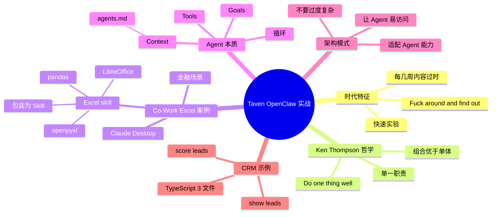

# Taven 创始人：将 OpenClaw 嵌入产品的实战经验

## 一句话总结

Taven 创始人（一家欧洲小型 Agent 公司）在一次会议演讲中分享**用 OpenClaw 做企业产品**的实战经验 — 用 Ken Thompson "do one thing and do it well" 哲学打造 Co-Work（Claude Desktop），自建 Excel skill 解决 Excel 集成问题，以及让 Agent 易访问性的架构模式。

## 核心洞察

### 1. "Fuck around and find out" 时代

> "We are in the fuck around and find out phase for coding agents."

> "Everything that I'm going to show you is what I know today. And I'm going to do the talk again in a couple of weeks. And it's going to most likely be different."

**现状**：每几周内容就过时，需要**快速实验、快速迭代**。

### 2. Ken Thompson 哲学 + Coding Agent

> "Write programs that do one thing and one thing well. And I really like that because that's kind of like works to our advantage with agents."

- 每个 Agent / Skill 做一件事
- 做到极致
- 组合而非庞大单体

### 3. Co-Work（Claude Desktop）的 Excel 案例

> "This is co-work, Claude's desktop. And they're basically abandoning their coding agent into something where they feel is more applicable. And to be honest, I've seen very good receptions around this. And when you use it with financing tools, with their finance tools, you always need to work with Excel, right? So they have this Excel skill now and there."

**实战问题**：金融场景永远要处理 Excel

**解法**：
- 不让 Agent 直接"对话"Excel（它不行）
- 改用**小工具集**：pandas、openpyxl、LibreOffice 工具
- **打包成 Skill** 让 Agent 调用

> "It uses a set of small tools, small CLIs, pandas, open-pikes, stuff from Libre Office and packaged this into their own skill to make it up and running."

### 4. Agent 的本质：简化版

> "An agent is actually just an LM agent that runs tools in a loop, right? So you have some goals, you have some context information, agents MD in many cases, and then you do tool calls, right?"

**Agent 三要素**：
1. **Goals**（目标）
2. **Context**（agents.md 等）
3. **Tools**（可调用的工具）
- 循环到完成为止

> "That's it, right? There's not much more. The rest is magic trying to put it in your use case."

### 5. 架构模式：让 Coding Agent 易访问

> "One architectural pattern that we're seeing is that make it easy for coding agents, right? Like, make not. Don't try to be very complex on things. But think about the coding agent, what is it good at? And how do I build my system so that the agent is easy, make it accessible?"

**核心问题**：
- 不要做太复杂
- 想清楚 Agent 擅长什么
- 设计**让 Agent 易访问**的系统

### 6. CRM Lead Qualifier 示例

> "Small TypeScript application, three files, really easy. And you can see this, right? You have a couple of commands that you can execute and you know, show me all leads and score them."

**实际例子**：
- TypeScript 应用
- 3 个文件
- 命令：`show me all leads` → `score them`
- 3 行命令完成 lead qualification

## 关键概念

| 概念 | 定义 |
|------|------|
| **Taven** | 欧洲小型 Agent 公司（"Tavenay Eye"），做企业 Agent |
| **Co-Work** | Claude 的桌面产品（vs Claude Code） |
| **Excel Skill** | 包装 pandas/openpyxl/LibreOffice CLI 的 Skill |
| **"Do one thing well"** | Ken Thompson 哲学应用于 Agent 设计 |
| **Agent 三要素** | Goals + Context + Tools（循环执行） |
| **Fuck around and find out** | 现阶段 Agent 现实，每几周内容就过时 |
| **Agent SDK** | Pi、Agent Core 等各种 Agent 开发框架 |
| **Extension/Skill** | 可下载或自建的 Agent 扩展 |

## 实战最佳实践

### Agent 产品设计原则

1. **让 Agent 易访问** — 不要过度复杂
2. **Do one thing well** — 单一职责
3. **工具集优于大接口** — 用 CLI 集而非直接 API
4. **包装成 Skill** — 用户不感知底层复杂度
5. **快速迭代** — 每几周重新评估

### Excel Skill 实现思路

```
用户需求：分析 Excel 数据
    ↓
不要：让 Agent 直接读写 xlsx 文件
不要：训练专门模型
    ↓
而是：组合现有 CLI 工具
  - pandas (Python)
  - openpyxl (Python)
  - LibreOffice (命令行)
    ↓
包装为 Skill
  - 用户说"分析 Sheet1 的销售数据"
  - Skill 调用 pandas.read_excel
  - Skill 调用 pandas 分析
  - Skill 输出结果
```

## 思维导图



## 原文金句（英中对照）

> **"We are in the fuck around and find our own face for coding agents. So everything that I'm going to show you is what I know today. And I'm going to do the talk again in a couple of weeks. And it's going to be most likely be different."**
> 译：*我们正处在 coding agent 的"边做边学"阶段。今天给你看的全是我现在知道的。几周后我再讲一次，几乎肯定会不一样。*

> **"Write programs that do one thing and one thing well. And I really like that because that's kind of like works to our advantage with agents."**
> 译：*写只做一件事、把它做好的程序。我很喜欢这个，因为它在 Agent 场景下对我们很有利。*

> **"An agent is actually just an LM agent that runs tools in a loop, right? So you have some goals, you have some context information, agents MD in many cases, and then you do tool calls, right? And you get some results, and you know, you basically do it in a loop, right? That's it, right? There's not much more."**
> 译：*Agent 实际上就是一个 LM agent 在循环里跑工具。你有一些目标、一些 context（很多时候是 AGENTS.md），然后调用工具，拿到结果，在循环里一直跑。就这些，没别的了。*

> **"Pretty please, don't open the curtain, play around with it."**
> 译：*请别光看不练，自己上手玩玩。*

> **"One architectural pattern that we're seeing is that make it easy for coding agents, right? Like, make not. Don't try to be very complex on things. But think about the coding agent, what is it good at? And how do I build my system so that the agent is easy, make it accessible?"**
> 译：*我们看到一个架构模式 — 让 coding agent 用起来简单。别试图搞太复杂。想想 coding agent 擅长什么，我要怎么构建我的系统，让 Agent 容易访问？*

## 行动启示

1. **现在就是试错时代** — 每几周重新评估你的 Agent 实现
2. **Do one thing well** — Agent / Skill 单一职责
3. **Excel 等"老大难"** — 用小工具组合而非直接 API
4. **打包成 Skill** — 隐藏底层复杂度
5. **让 Agent 易访问** — 比功能全更重要
6. **从简单开始** — 3 个文件 + 几行命令的 CRM lead qualifier
7. **Pi / Agent Core / Claude Code** — 都值得尝试

## 关联笔记

- [[MOC - Agent Theory and Design]] — AI Agent 总索引
- [[MOC - Agent Theory and Design]] — B站视频知识库索引
- [[Agent实战-打造一个AI Agent的完整教程]] — Agent 入门
- [[OpenClaw创始人-我是如何使用OpenClaw的？]] — OpenClaw 创始人视角
- [[30分钟精通OpenClaw]] — OpenClaw 实战
- [[Claude Code实战-构建一个AI数据分析师]] — Claude Code 实战
- [[AI Agent Development]] — AI Agent 开发系统知识

## 来源

- **原始视频**：[BV1dZLS66E3m - Taven创始人：将OpenClaw嵌入产品的实战经验](https://www.bilibili.com/video/BV1dZLS66E3m/)
- **UP主**：[Easonlee的AI笔记](https://space.bilibili.com/3546559488723681/upload/video)
- **生成工具**：Recastory（手动 ingest + faster-whisper 转录 + LLM distill）
- **生成日期**：2026-06-10
- **转录模型**：faster-whisper base（en）
- **规范**：英文原文附中文翻译（[[kb-english-chinese-translation|记忆规则]]）
